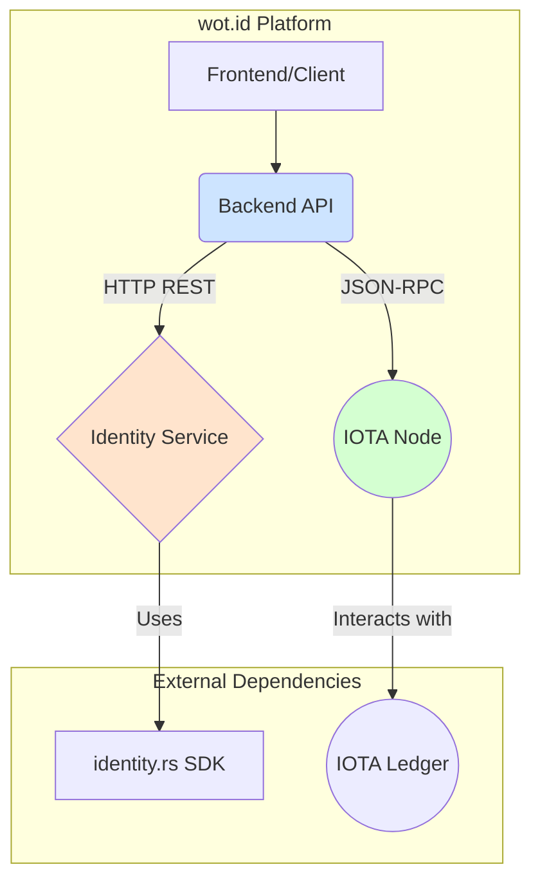
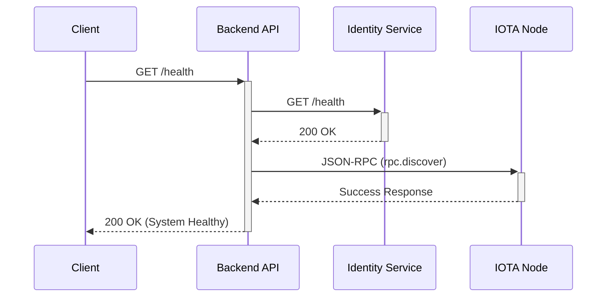
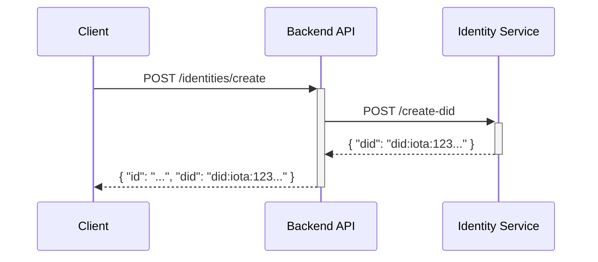

# 02: wot.id - System Architecture

## 1. Introduction

This document outlines the system architecture of the `wot.id` platform. It describes the core components, their interactions, and the key design decisions that shape the system. The architecture is designed to be modular, resilient, and aligned with IOTA's unique capabilities.

## 2. Architectural Drivers

A key driver for the current architecture is a dependency conflict related to the Tokio runtime. The `identity.rs` library, essential for certain identity operations, requires an older version of Tokio (v1.43.0) that is incompatible with the main `Backend API`'s modern technology stack (Axum v0.8+, Reqwest v0.12+).

To resolve this, `wot.id` employs a microservice approach, isolating the `identity.rs` functionality within a dedicated `Identity Service`. This pragmatic solution ensures dependency isolation and allows the main backend to evolve with the latest libraries.

*See related discussions in the main repository: [iotaledger/identity.rs](https://github.com/iotaledger/identity.rs)*

## 3. System Components

The `wot.id` platform consists of three primary components that work in concert:

*   **Backend API**: The central orchestrator, built with Rust and Axum (on Tokio v1.45.0+). It handles business logic, coordinates with other services, and constructs on-chain transactions.
*   **Identity Service**: A specialized microservice, also built with Rust and Axum, but pinned to Tokio v1.43.0. Its sole purpose is to encapsulate logic dependent on the `identity.rs` library.
*   **IOTA Node**: An official `iotaledger/iota-core` node (See: [iota-core GitHub](https://github.com/iotaledger/iota-core)) that provides the interface to the IOTA ledger via a JSON-RPC 2.0 API. (See: [IOTA JSON-RPC API](https://docs.iota.org/references/iota-api/json-rpc-format))

## 4. Architectural Diagrams

### 4.1. Component Overview

This diagram illustrates the high-level relationship between the core components and external clients.

### 4.2. Interaction Flows

#### Health Check Sequence

This sequence shows how the `Backend API` performs a system-wide health check.

#### DID Creation Sequence (Conceptual)

This sequence illustrates the conceptual flow for creating a Decentralized Identifier.

## 5. On-Chain Interaction Model: PTBs

All state-changing interactions with the IOTA ledger, particularly with custom Move smart contracts, are executed via **Programmable Transaction Blocks (PTBs)**. The `Backend API` is responsible for constructing and submitting these PTBs using the official **Rust `iota-sdk`** (See: [Rust iota-sdk GitHub](https://github.com/iotaledger/iota-sdk/tree/develop/sdk)).

PTBs are powerful constructs that allow for bundling multiple atomic operations into a single transaction. This is crucial for complex workflows like creating a trust relationship or issuing a verifiable credential.

### 5.1. Key Concepts Used

The backend leverages several core IOTA concepts when building PTBs:

*   **Atomic Execution**: Multiple commands (e.g., transferring funds, calling a contract) are executed as a single, all-or-nothing transaction.
*   **`moveCall`**: The specific command within a PTB used to invoke a function in a deployed Move smart contract.
*   **Gas Management**: PTBs include mechanisms for specifying a gas budget and providing payment for smart contract execution.
*   **Object Model & Dynamic Fields**: The backend logic aligns with the Move contract patterns for representing on-chain entities (like `IdentityObject`) and storing flexible data.

This approach ensures that all on-chain interactions are robust, efficient, and align with official IOTA developer best practices.

### 5.2. References

*   **IOTA Rust SDK**: [Rust iota-sdk GitHub](https://github.com/iotaledger/iota-sdk/tree/develop/sdk)
*   **Programmable Transaction Blocks (PTBs)**: [Programmable Transaction Blocks Overview](https://docs.iota.org/developer/iota-101/transactions/ptb/programmable-transaction-blocks-overview)
*   **IOTA Node (iota-core)**: [iota-core GitHub](https://github.com/iotaledger/iota-core)
*   **IOTA JSON-RPC API**: [IOTA JSON-RPC API Format](https://docs.iota.org/references/iota-api/json-rpc-format)
*   **IOTA Identity SDK (Rust)**: [identity.rs GitHub](https://github.com/iotaledger/identity.rs)

## 6. Network and Environment

### 6.1. Default Ports

| Component            | Port  |
|----------------------|-------|
| Backend API          | 8080  |
| Identity Service     | 8081  |
| IOTA Node (JSON-RPC) | 19000 |

### 6.2. Environment Variables

The system is configured via environment variables:

- `BACKEND_PORT=8080`: Port for the Backend API.
- `IDENTITY_SERVICE_URL=http://127.0.0.1:8081`: Full URL for the Identity Service.
- `IOTA_NODE_URL=http://127.0.0.1:19000`: Full URL for the IOTA Node's JSON-RPC endpoint.

## 7. Deployment and Startup

1.  **Start the IOTA Node**: Typically run via Docker using the `iotaledger/iota-core` image. (See: [iota-core GitHub](https://github.com/iotaledger/iota-core) for setup instructions).
2.  **Start the Identity Service**: Run as a separate Rust process.
3.  **Start the Backend API**: Run as a separate Rust process.

## 8. Future Considerations

The `Identity Service` is a pragmatic solution to the current dependency conflict. If the `identity.rs` library is updated to support modern Tokio versions, its functionality could be reintegrated into the main `Backend API`. However, the microservice architecture may be retained for its resilience and isolation benefits.

