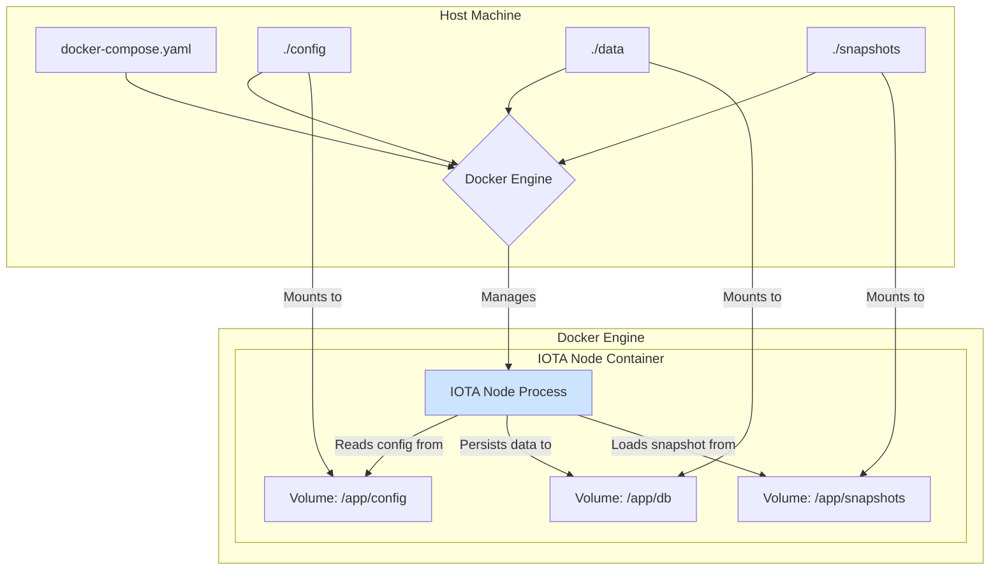

# 03: wot.id - IOTA Node and Network

## 1. Introduction

This document provides comprehensive guidance for setting up and configuring an IOTA Full Node for the `wot.id` project. A correctly configured node is fundamental for all on-chain operations. The focus is on using official IOTA Docker images and best practices to ensure a robust, secure, and maintainable environment.

## 2. Node Setup and Configuration

The recommended approach is to use the official IOTA Docker setup, which simplifies deployment and aligns with IOTA Foundation standards.

### 2.1. Visualizing the Node Setup

This diagram illustrates the key components of the Dockerized node environment:



### 2.2. Core Configuration (`config.yaml`)

The node's behavior is controlled by a `config.yaml` file. Below is a summary of the most critical parameters for `wot.id`.

| Parameter                             | Example Value                      | Purpose                                                                                             |
|---------------------------------------|------------------------------------|-----------------------------------------------------------------------------------------------------|
| `protocol.networkName`                | `rebased-devnet`                   | **Crucial**. Identifies the target network, ensuring the node connects to the correct ledger.         |
| `db.path`                             | `/app/db/mainnetdb`                | Path inside the container for the node's database. Must align with the Docker volume mount.       |
| `jsonRpc.address`                     | `0.0.0.0:9000`                     | The address and port the JSON-RPC API listens on *inside* the container.                          |
| `p2p.listenMultiaddrs`                | `["/ip4/0.0.0.0/udp/8084/quic-v1"]` | The address the node uses for peer-to-peer communication.                                           |
| `p2p.bootstrapPeers`                  | `["/dns/bootnode.rebased.iota.org/..."]` | A list of initial seed peers used to discover other nodes on the network.                           |
| `protocol.snapshot.path`              | `/app/snapshots/latest.snapshot`   | Path inside the container to the snapshot file used for fast bootstrapping.                       |
| `authority-store-pruning-config`      | (See section 3.2)                  | Configures how aggressively the node prunes old data to manage disk space.                        |

*For a complete overview of configuration options, refer to the [Official IOTA Full Node Configuration Guide](https://docs.iota.org/operator/full-node/configuration/).*

## 3. Key Operational Concepts

### 3.1. Snapshots and Bootstrapping

Snapshots are essential for quickly synchronizing a new node without processing the entire history of the ledger.

**Process:**
1.  **Obtain a Snapshot**: Download a recent, official snapshot for the target network (e.g., `rebased-devnet`). These are typically provided as `RocksDB` (full state) or `Formal` (minimal) snapshots.
2.  **Place in Volume**: Move the downloaded snapshot file into the local directory that is volume-mounted to `/app/snapshots` in the container.
3.  **Configure Path**: Ensure the `protocol.snapshot.path` in your `config.yaml` points to the correct file location within the container.
4.  **Start the Node**: On its first start, the node will load from the snapshot, significantly reducing sync time.

*Reference: [Official IOTA Snapshots Documentation](https://docs.iota.org/operator/full-node/configs/snapshots)*

### 3.2. Pruning and Disk Management

Pruning is critical for managing the long-term disk space usage of a node.

**Pruning Strategies:**
*   **Minimal Node (Low Disk Usage)**: 
    *   `enable-index-processing: false`
    *   `num-epochs-to-retain: 0`
    *   **Impact**: Lowest disk footprint, but the node cannot answer most indexed queries (e.g., balance lookups) or serve historical data.
*   **Indexing Node (Balanced)**: 
    *   `enable-index-processing: true`
    *   `num-epochs-to-retain: 5` (A reasonable number for retaining recent history)
    *   **Impact**: This is the **recommended setup for `wot.id` development**. It allows for full query capability for recent data while still managing disk space.
*   **Full History/Archive Node (High Disk Usage)**:
    *   `enable-index-processing: true`
    *   `num-epochs-to-retain: u64::max`
    *   **Impact**: Attempts to keep all ledger history. Requires significant, ever-increasing disk space and is generally not necessary for typical application backends.

*Reference: [Official IOTA Pruning Documentation](https://docs.iota.org/operator/full-node/configs/pruning)*

### 3.3. Peering

Peering is the process by which your node connects to other nodes to form the network. A reliable peering setup is vital for staying synchronized.

*   **Bootstrap Peers**: The `p2p.bootstrapPeers` list in `config.yaml` provides the initial entry points. It is critical to use the official, up-to-date peer list for the target network.
*   **Autopeering**: Modern IOTA nodes support autopeering, which automatically discovers and manages peer connections after the initial bootstrap. This is typically enabled by default and is the recommended approach.
*   **Firewall**: Ensure your firewall allows inbound traffic on the P2P port (e.g., `8084/udp`) to allow other nodes to connect to you.

## 4. Maintenance and Best Practices

*   **Monitoring**: Regularly monitor node health, disk space, memory usage, and peer count.
*   **Updates**: Keep the node's Docker image up-to-date by pulling the latest official images.
*   **Backup**: Regularly back up your `config` directory and any other critical files.

## 5. Official Setup Procedure

The official IOTA documentation provides a streamlined setup process that bundles the correct configuration, Docker images, and snapshots for a given network. This procedure replaces the need to manually track individual parameters and action items.

**To set up a node for the target network (e.g., `devnet`):**

1.  **Download the Official Setup Package**:
    Run the following command in your terminal. This will create a directory, download the correct `docker-compose.yaml` and `fullnode.yaml`, and unzip them.

    ```bash
    # For devnet
    mkdir iota-fullnode-docker-setup && cd iota-fullnode-docker-setup && curl -L https://fullnode-docker-setup.iota.org/devnet | tar -zx
    ```
    *Note: Replace `devnet` with `testnet` or `mainnet` as needed.*

2.  **Prepare the Node**:
    Navigate into the new `iota-fullnode-docker-setup` directory and run the preparation script. This script automatically pulls the correct Docker images and downloads the latest network snapshot.

    ```bash
    ./prepare.sh
    ```

3.  **Configure and Start**:
    - (Optional) Modify `data/config/fullnode.yaml` if you need to customize P2P settings or other parameters.
    - Start the node using Docker Compose:

    ```bash
    docker compose up -d
    ```

This official process ensures that the **Docker Image**, **Network Name**, **Bootstrap Peers**, and **Snapshot Paths** are always correct and up-to-date, as they are managed by the IOTA Foundation and bundled in the setup package.

*Reference: [Official IOTA Docker Setup Guide](https://docs.iota.org/operator/full-node/docker)*

## 6. Transitional Notes: Custom `iota-node-v7` Setup

This section contains notes on the previous custom `iota-node-v7` setup. **This setup is deprecated for `wot.id` and should be replaced by the official Docker setup described above.** It is retained here for historical context and to aid in migration.

*   **Overview**: The custom setup was based on a specific, older version of the `iotaledger/iota` repository and used custom Docker configurations, genesis files, and migration blobs. This was tailored for a network state that is not compatible with the current IOTA Rebased network.
*   **Migration Path**: Migrating involves archiving the old setup, following the official setup guide in this document, updating the `wot.id` backend's `IOTA_NODE_URL` to point to the new node, and thoroughly testing all on-chain interactions. It is typically built from a local clone of the `iotaledger/iota` repository (specifically, the `develop` branch located at `/Users/axelnoack/CascadeProjects/iota/`).

## 6.1. Detailed Custom `iota-node-v7` Setup (Transitional - For Migration Reference Only)

**IMPORTANT NOTE: The following section describes a deprecated custom setup for `iota-node-v7`. It is retained *temporarily* for reference during migration to a new machine, as per current requirements. For all new setups and ongoing development, please refer to Section 5: "Official Setup Procedure", which details the recommended IOTA Docker setup.**

The `iota-node-v7` is run locally using Docker and managed via Docker Compose. This approach ensures a consistent and reproducible environment.

{{ ... }}

The `iota-node-v7` was run locally using Docker and managed via Docker Compose. This approach ensured a consistent and reproducible environment.

#### 4.2.1. Docker Compose (`docker-compose.yaml`) - Custom `iota-node-v7`

The `docker-compose.yaml` file for `iota-node-v7` (typically located in a path like `/Users/axelnoack/CascadeProjects/iota-node-v7/docker/`) defines the `fullnode` service with key configurations:

*   **Build Context**: Set to point to the root of the `iota-node-v7` project (e.g., `../../` from the Docker directory, resolving to `/Users/axelnoack/CascadeProjects/`). This allows the Dockerfile to access necessary local files.
*   **Dockerfile**: Specifies the custom Dockerfile (e.g., `/Users/axelnoack/CascadeProjects/iota-node-v7/docker/Dockerfile`) used to build the node image.
*   **Volume Mounts**:
    *   Configuration: e.g., `./l1-data/config:/iota/config` (maps local config to container).
    *   Database: e.g., `./l1-data/db:/iota/db` (for ledger state persistence).
    *   Other necessary data or script mounts.
*   **Port Mapping**:
    *   **JSON-RPC API**: `19000:9000/tcp` (Exposes the node's internal JSON-RPC port `9000` as `19000` on the host). The `wot.id` backend services connect to this host port. 
    *   **P2P Port**: e.g., `8084:8084/udp` (Exposes the node's P2P communication port. The official default is often `8084/udp`. Verify the actual port used by `iota-node-v7` and update here). 
    *   *Note: The legacy REST API port (e.g., 18080) is NOT mapped or used, as `iota-node-v7` (a rebased node) exclusively uses JSON-RPC.*
*   **Healthcheck**: A healthcheck command is often configured to monitor the node's status within Docker.

    *   Snapshots (if applicable for bootstrapping): e.g., `./l1-data/snapshots:/iota/snapshots` (if local snapshot files are used for bootstrapping).

#### 4.2.2. Dockerfile (`Dockerfile` for `iota-node-v7`) - Custom Build

The custom `Dockerfile` for `iota-node-v7` includes specific build steps:

*   **Base Image**: An appropriate base image (e.g., a Rust environment).
*   **COPY Local `iotaledger/iota` Source**: Copies the local clone of `iotaledger/iota` (from `/Users/axelnoack/CascadeProjects/iota/` on the `develop` branch) into the builder stage.
*   **Build Node**: Compiles the `iota-node` binary from this source.
*   **COPY `genesis.blob` and `migration.blob`**:
    *   Copies `genesis.blob` and `migration.blob` from the root of the local `iotaledger/iota` clone (expected at `/Users/axelnoack/CascadeProjects/iota/`) into the builder stage (e.g., to `/iota/` within the builder).
    *   These blobs are then copied from the builder stage to the final runtime image (e.g., to `/iota/` in the runtime stage). This makes them available to the node at runtime.
*   **Entrypoint/Command**: Sets the command to start the `iota-node` binary, pointing to its configuration file.

### 4.3. Node Configuration (`fullnode.yaml` for `iota-node-v7`) - Custom Setup

The behavior of `iota-node-v7` is controlled by its configuration file, `fullnode.yaml`. When using the Docker setup, this file is typically located at `/Users/axelnoack/CascadeProjects/iota-node-v7/docker/l1-data/config/fullnode.yaml` on the host and mounted into `/iota/config/fullnode.yaml` in the container. Developers can modify this file to customize the node's operation.

Below are key configuration areas, referencing parameters found in the official IOTA Node Operator documentation. Ensure these are adapted for the specific version and needs of `iota-node-v7`.

#### 4.3.1. Key Settings in `fullnode.yaml` (Custom `iota-node-v7`)

*   **`protocol.genesisFileLocation`**: Crucially, this must point to the location of the `genesis.blob` file within the container, e.g., `/iota/genesis.blob`. This file defines the initial state of the ledger.
*   **`protocol.migrationTxDataPath`**: Similarly, this must point to the `migration.blob` file, e.g., `/iota/migration.blob`, containing data for network migration if applicable.
*   **`db.path`**: Specifies the directory within the container where the node stores its database (e.g., `/iota/db`). This path is typically mapped to a host volume for persistence.
*   **`restApi.enabled`**: Should be `false`. The legacy REST API is not used by IOTA Rebased nodes.
*   **`jsonRpc.address`**: Configures the JSON-RPC API listener within the container (e.g., `"0.0.0.0:9000"`). 
*   **`inx.address`**: Configuration for the INX interface if used (e.g., for Wasp L2 integration).


Proper network configuration is vital for the node to connect to peers and synchronize with the IOTA Rebased network.

*   **`p2p.listenMultiaddrs`**: Defines the P2P listening addresses for incoming connections (e.g., `["/ip4/0.0.0.0/udp/8084/quic-v1"]`). The port should match the one exposed in Docker. 
*   **`p2p.seedPeers`**: (Or equivalent configuration, e.g., `p2p.bootstrapPeers` or autopeering settings). This section in `fullnode.yaml` specifies initial peers for the node to connect to for discovering other nodes in the network. For local development on "IOTA Rebased," these might be specific project-defined seed nodes or public devnet peers if applicable. 
*   **Firewall Considerations**: If running the node in an environment with a restrictive firewall, ensure the P2P port (e.g., `8084/udp`) and the JSON-RPC port (e.g., `19000/tcp` on the host) are open for necessary traffic.


Snapshots allow a node to bootstrap quickly without processing all transactions since genesis. Official IOTA nodes support RocksDB (full state) and Formal (minimal, verifiable) snapshots.

*   **`protocol.snapshot.path`**: Path within the container to a snapshot file (e.g., `/iota/snapshots/latest.snapshot`).
*   **Bootstrapping `iota-node-v7`**: 
    *   
    *   Does it sync from genesis using `genesis.blob`? (Slow, but ensures full history from start).
    *   Does it use a pre-downloaded snapshot specified by `protocol.snapshot.path`? If so:
        *   What type of snapshot (RocksDB/Formal)?
        *   Where do developers get this snapshot file for "IOTA Rebased"? (e.g., a project-specific URL, manual download procedure, or included in the `iota-node-v7` repository). The official Docker setup uses a `prepare.sh` script to download snapshots; clarify the `wot.id` equivalent.
*   **Local Snapshot Creation**: 
    *   Nodes can be configured to create snapshots periodically (`db-checkpoint-config` for RocksDB, `state-snapshot-write-config` for Formal). 
    *   For typical local development with `wot.id`, this is likely **disabled** to save resources, relying instead on bootstrapping from a provided snapshot or genesis.
    *   If ever needed, refer to official IOTA Node Operator docs for configuration details.


Pruning manages disk space by removing old object versions and transaction data. Configuration is typically under `authority-store-pruning-config` (or similar, verify for `iota-node-v7`).

*   **`num-epochs-to-retain`**: (Object Pruning) Number of past epochs for which to retain object versions. `0` is aggressive (keeps only latest), `u64::max` keeps all history (high disk usage). 
*   **`num-epochs-to-retain-for-checkpoints`**: (Transaction Pruning) Number of past epochs for which to retain transaction data. `2` is common.
*   **`enable-index-processing`**: If `true` (default), maintains secondary indexes for queries like `iotax_getBalance`. If `false`, creates a "Minimal Full Node" with reduced disk usage but limited query capability.
*   **Recommended for `wot.id` Development**: 
    *   
    *   A balance might be: `enable-index-processing: true`, `num-epochs-to-retain: 0` (or a small number like `2-5` if some history is needed), `num-epochs-to-retain-for-checkpoints: 2`.
    *   This depends on whether developers need to query historical object states frequently.
*   Refer to the [official IOTA Pruning documentation](https://docs.iota.org/operator/full-node/configs/pruning) for detailed explanations.


Archives allow nodes to retrieve historical data that might have been pruned locally or by peers. Nodes can be configured to read from a remote archive (`state-archive-read-config`).

*   **Relevance for `wot.id`**: For local `iota-node-v7` development, configuring an archival fallback is likely **not necessary** unless:
    *   The local node uses very aggressive pruning, AND
    *   Developers frequently need very old historical data, AND
    *   The "IOTA Rebased" network has a designated public archive that `wot.id` nodes can use.
    *   
*   If needed, configuration involves specifying the object store (e.g., S3, GCS) and bucket details in `state-archive-read-config`. See [official IOTA Archives documentation](https://docs.iota.org/operator/full-node/configs/archives).

The primary configuration file for `iota-node-v7` is `fullnode.yaml`. When using the Docker setup described, this file is typically located at a path like `/Users/axelnoack/CascadeProjects/iota-node-v7/docker/l1-data/config/fullnode.yaml` on the host and mounted into `/iota/config/fullnode.yaml` in the container.

Key settings include:

*   **`p2p.listenMultiaddrs`**: Defines the P2P listening addresses (e.g., `["/ip4/0.0.0.0/udp/15600/quic-v1"]`).
*   **`protocol.snapshot.path`**: Path to the snapshot file.
*   **`protocol.genesisFileLocation`**: Crucially, this must point to the location of the `genesis.blob` file within the container, e.g., `/iota/genesis.blob`.
*   **`protocol.migrationTxDataPath`**: Similarly, this must point to the `migration.blob` file, e.g., `/iota/migration.blob`.
*   **`restApi.enabled`**: `false`. The REST API is not used and should be explicitly disabled if the option exists in `iota-node-v7`'s configuration.
*   **`inx.address`**: Configuration for the INX interface if used (e.g., for Wasp L2).
*   **`jsonRpc.address`**: `"0.0.0.0:9000"` (or the default internal JSON-RPC port for `iota-node-v7`). This configures the node to listen for JSON-RPC requests on all interfaces within the container on the specified internal port.

### 4.4. Genesis and Migration Blobs (Custom `iota-node-v7`)

For the IOTA Rebased network and `iota-node-v7`, `genesis.blob` and `migration.blob` files are essential:

*   **`genesis.blob`**: Defines the initial state of the ledger (genesis snapshot).
*   **`migration.blob`**: Contains data related to the migration from a previous network version if applicable.

These files must be compatible with the `develop` branch of `iotaledger/iota` being used to build `iota-node-v7`.
*   **Location Requirement**: They are expected to be present at the root of the local `iotaledger/iota` repository (`/Users/axelnoack/CascadeProjects/iota/`) for the Docker build process to copy them into the node image.
*   **Current Status**: As per recent project memory, there was a blocker where these files were missing from the expected location, preventing successful Docker builds. Ensuring their presence and correctness is a prerequisite for running the node.

### 4.5. API Interaction: JSON-RPC Exclusively (Custom `iota-node-v7`)

Interaction with `iota-node-v7` (and other IOTA Rebased nodes) is **exclusively through its JSON-RPC 2.0 API**. The legacy REST-like HTTP API is deprecated and not available.

*   **Endpoint**: The `wot.id` backend services use the `IOTA_NODE_URL` environment variable (e.g., `http://127.0.0.1:19000`) to connect to the node's JSON-RPC API exposed by Docker.
*   **Protocol**: JSON-RPC 2.0.
*   **Content-Type**: `application/json`.
*   **Health Checks**: The `Backend API` uses the `rpc.discover` JSON-RPC method to perform health checks on the IOTA node. This method is lightweight and returns information about available RPC methods, confirming the node is responsive.
    ```bash
    curl -s http://localhost:19000 -X POST \
         -H "Content-Type: application/json" \
         -d '{
           "jsonrpc": "2.0",
           "id": "1",
           "method": "rpc.discover",
           "params": {}
         }'
    ```
*   **Client Integration**: All `wot.id` services interacting with the node MUST use JSON-RPC, implement robust error handling (timeouts, connection failures, JSON-RPC errors), and use specific methods for all operations.

### 4.6. Operational Commands and Troubleshooting (Custom `iota-node-v7`)

Common commands for managing the local `iota-node-v7` Docker container:

*   **Start the node**: `docker compose up -d` (from the directory containing the `docker-compose.yaml`)
*   **Stop the node**: `docker compose stop`
*   **View logs**: `docker compose logs -f fullnode` (or the specific service name if different)
*   **Check container status**: `docker ps` (to ensure the `fullnode` container is running).
*   **Accessing Shell in Container (for debugging)**: `docker compose exec fullnode /bin/sh` (or `/bin/bash`)

Troubleshooting steps:

*   **Docker Logs**: Always check `docker compose logs fullnode` first for detailed node output and error messages.
*   **Test JSON-RPC Endpoint**: Use `curl` with `rpc.discover` or another simple method (like `info` if available on `iota-node-v7`) to verify connectivity to `http://localhost:19000` (or your mapped host port).

*   **Check Docker Container**: `docker ps` to ensure the `fullnode` container is running.
*   **Docker Logs**: `docker logs <container_name_or_id>` (e.g., `docker logs iota-node-v7-docker-fullnode-1`) for detailed node output and errors.
*   **Test JSON-RPC Endpoint**: Use `curl` with `rpc.discover` or another simple method (like `info` if available on `iota-node-v7`) to verify connectivity to `http://localhost:19000`.

## 7. General Update and Maintenance (Applicable to any Node Setup)

Regardless of the setup method, keeping your IOTA node software, configurations, and underlying system (including Docker) up-to-date is crucial for security, stability, and compatibility with the evolving IOTA network.

*   **Monitor Official Channels**: Regularly check official IOTA announcements (Discord, forums, GitHub repositories) for updates on node software, security advisories, and changes to network parameters or seed peers.
*   **Update Docker Image**: Periodically pull the latest official Docker image for your node (e.g., `docker compose pull fullnode`).
*   **Review Configuration**: When updating node software, review the release notes for any changes to configuration parameters. Default configuration files may also be updated, so compare your custom `config.yaml` with new defaults.
*   **Snapshot Management**: If not using a service that automatically updates snapshots (like `prepare.sh`), ensure you periodically fetch and use recent snapshots for faster recovery or new node bootstrapping.
*   **Backup**: Regularly back up critical data, especially your node's identity/key files (if applicable and not managed by Docker volumes mapped to persistent storage) and any custom configurations.
*   **System Updates**: Keep the host operating system and Docker engine updated.

