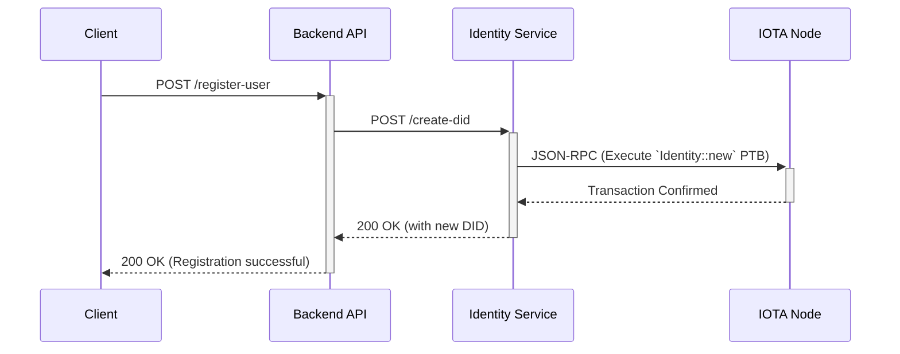
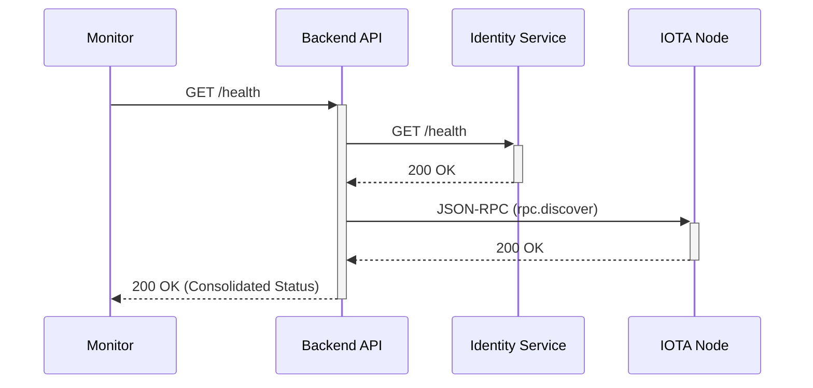

# 04: wot.id - Backend and Identity Service

## 1. High-Level Architecture

The `wot.id` backend consists of two core Rust microservices: the **Backend API** (the main orchestrator) and the **Identity Service** (a specialized DID management service). This separation is a deliberate architectural choice to isolate dependencies and manage complexity.

```mermaid
graph TD
    subgraph User Layer
        Client[Client App]
    end

    subgraph Service Layer
        Backend[Backend API]
        Identity[Identity Service]
    end

    subgraph IOTA L2
        Node[IOTA Node]
        Contract[Identity Move Contract]
    end

    Client -- HTTP API --> Backend
    Backend -- HTTP API --> Identity
    Backend -- JSON-RPC --> Node
    Identity -- JSON-RPC --> Node
    Node -- Interacts with --> Contract

    note right of Contract : Identity Move Contract on IOTA L2
    note right of Node : (See: [IOTA Move Overview](https://docs.iota.org/developer/iota-101/move-overview))

    style Backend fill:#cde4ff
    style Identity fill:#d5e8d4
```

### Separation of Responsibilities

| Feature / Responsibility                  | Backend API                                                              | Identity Service                                                                  |
|-------------------------------------------|--------------------------------------------------------------------------|-----------------------------------------------------------------------------------|
| **Primary Role**                          | System Orchestrator & Business Logic Hub                                 | Specialized DID Lifecycle Manager                                                 |
| **Client-Facing API**                     | Yes (Main entry point for frontends)                                     | No (Internal service only)                                                        |
| **DID Operations (Create, Update, etc.)** | Delegates to Identity Service                                            | **Owns** all DID operations via `identity.rs` SDK                                 |
| **Smart Contract Interaction**            | Interacts with general `wot.id` contracts (e.g., Trust, Governance)      | Interacts **exclusively** with the `Identity` Move contract                       |
| **Health Monitoring**                     | Provides a consolidated system health check                              | Provides its own health status                                                    |
| **Key Dependency**                        | `reqwest` (for HTTP), [`iota-sdk`](https://github.com/iotaledger/iota-sdk/tree/develop/sdk) (for PTBs)                                | [`identity_iota` SDK](https://github.com/iotaledger/identity.rs), [`iota-sdk`](https://github.com/iotaledger/iota-sdk/tree/develop/sdk)                                                   |
| **Async Runtime (Tokio)**                 | v1.45.0+                                                                 | v1.43.0 (or as required by `identity.rs`)                                         |

**Primary Rationale for Separation**: To resolve a critical dependency conflict. The `identity.rs` SDK requires an older version of the Tokio runtime than the main Backend API, making it impossible to compile them in the same binary. The microservice architecture provides a clean solution.

---

## 2. Backend API

The Backend API is the central nervous system of `wot.id`, handling all incoming client requests and orchestrating the necessary actions.

*   **Technology**: Rust, Axum (v0.8+), Tokio (v1.45.0+)
*   **Port**: `8080`

### API Endpoints

| Method | Path         | Description                                                                                                |
|--------|--------------|------------------------------------------------------------------------------------------------------------|
| `GET`  | `/health`    | Returns a consolidated health status of the entire system (backend, identity service, and IOTA node).      |
| `POST` | `/users`     | Example: Registers a new user, triggering a call to the Identity Service to create a new DID.              |
| `POST` | `/attest`    | Example: Creates a new on-chain trust attestation by constructing a PTB and sending it to the IOTA node.   |

---

## 3. Identity Service

The Identity Service is a focused microservice that encapsulates all logic for managing IOTA DIDs.

*   **Technology**: Rust, Axum, Tokio (v1.43.0), `identity_iota` SDK
*   **Port**: `8081`

### API Endpoints

| Method | Path           | Description                                                                                                   |
|--------|----------------|---------------------------------------------------------------------------------------------------------------|
| `GET`  | `/health`      | Returns the health status of the Identity Service itself.                                                     |
| `POST` | `/create-did`  | Creates a new IOTA DID on-chain by interacting with the deployed `Identity` Move contract. Returns the new DID. |

---

## 4. Interaction Flows

### DID Creation Sequence

This flow shows how a new DID is created when a user registers.



### System Health Check Sequence

This flow shows how the Backend API provides a consolidated health status.



---
        "message": "Execution error",
        "data": { "details": "Specific error details from Move execution..." }
      }
    }
    ```
    The `Identity Service` then processes this JSON-RPC response (success or error), translates it into its own HTTP REST API response format, and returns that to the `Backend API` (e.g., the new DID document or an appropriate HTTP error).
6.  The `Backend API` receives the published DID document (or relevant DID information) from the `Identity Service` and then proceeds with any further application-specific logic (e.g., associating the DID with a user profile) before responding to the original client application.

## 5. Configuration (Environment Variables)

Both services rely on environment variables for configuration:

- **`BACKEND_PORT=8080`**: Specifies the port on which the `Backend API` listens.
- **`IDENTITY_SERVICE_URL=http://127.0.0.1:8081`**: The full URL the `Backend API` uses to connect to the `Identity Service`.
- **`IOTA_NODE_URL=http://127.0.0.1:19000`**: The URL for the IOTA Node's JSON-RPC endpoint. This is used by:
    - The `Backend API` for any direct ledger interactions it might perform (e.g., related to `wot.id`'s custom Move smart contracts for trust, attestations).
    - The `Identity Service` (via the `identity_iota` and `iota-sdk`) for all its interactions with the IOTA L2 concerning DID operations.
- **`IOTA_IDENTITY_PKG_ID`**: The Object ID (Package ID) of the deployed `Identity` Move smart contract package on the target IOTA L2 network. This is a **critical configuration for the `Identity Service`**. (This ID is specific to the target IOTA L2 network, e.g., `rebased-devnet`, and must be obtained after the `Identity` Move contract package is deployed to that network.) Example: `0xabcdef123...`

## 6. Deployment and Operational Notes

- Both the `Backend API` and `Identity Service` are run as separate processes.
- They can be deployed as separate containers or native processes.
- Startup order (as mentioned in `02_System_Architecture.md`): IOTA Node first, then Identity Service, then Backend API.

## 7. Future Considerations for Identity Service

The microservice architecture for the `Identity Service` provides significant benefits in terms of focused responsibility, dependency management, security boundaries, and independent evolution.
- **Monitoring IOTA Identity Ecosystem**: The `wot.id` project will continue to monitor updates to the `identity_iota` SDK, `iota-sdk`, and the IOTA Identity framework.
- **Architectural Stability**: While initially prompted by considerations including dependency versioning (like Tokio), the current microservice architecture is well-justified by its modularity and clear separation of concerns. It is likely to be retained for these strategic advantages, allowing the `Identity Service` to evolve as a specialized component dedicated to IOTA identity management, even if all underlying technical version constraints were to be fully harmonized with the `Backend API`'s stack in the future.

