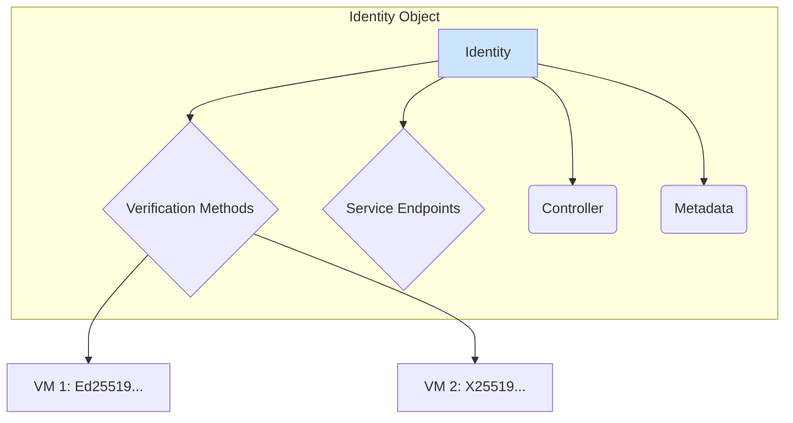
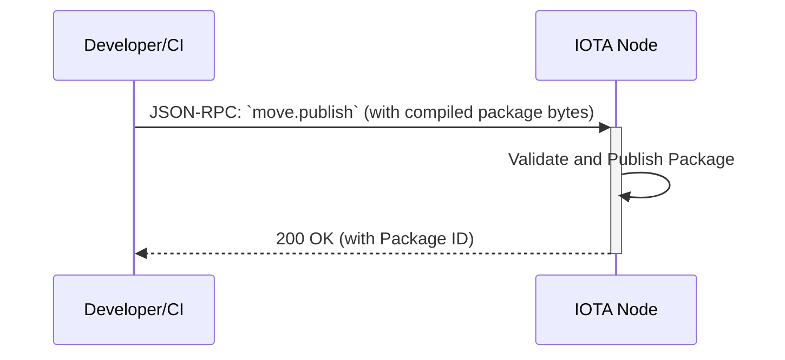
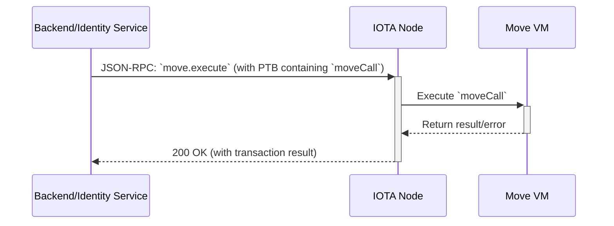

# 05: wot.id - Move Smart Contracts

## 1. Overview

The `wot.id` platform utilizes the **Move programming language** to implement its on-chain logic. These smart contracts are deployed to the IOTA Layer 2 (L2), which runs the Move Virtual Machine (Move VM). They are the foundation for managing digital identities, trust relationships, and other core primitives of the `wot.id` ecosystem.

All interactions with these contracts are performed by constructing **Programmable Transaction Blocks (PTBs)** (See: [Programmable Transaction Blocks Overview](https://docs.iota.org/developer/iota-101/transactions/ptb/programmable-transaction-blocks-overview)) and submitting them to an IOTA node's JSON-RPC 2.0 API (See: [IOTA JSON-RPC API Format](https://docs.iota.org/references/iota-api/json-rpc-format)). The `wot.id` platform leverages IOTA's native support for Move (See: [IOTA Move Overview](https://docs.iota.org/developer/iota-101/move-overview)). This document details the architecture of these contracts and the mechanisms used to interact with them.

---

## 2. Core Smart Contract: `identity`

The most critical on-chain component is the `identity` smart contract. It is responsible for creating and managing W3C-compliant Decentralized Identifiers (DIDs). The `Identity Service` (see Doc 04) is the primary off-chain service that interacts with this contract.

### 2.1. Data Structure

The core `Identity` object is a Move struct that encapsulates all data related to a single DID.



### 2.2. Move Struct Definition

The simplified Move struct for the `Identity` object looks like this. It holds a collection of verification methods and service endpoints, crucial for DID resolution and interaction.

```move
// Example from wot_id::identity module
struct Identity has key, store {
    id: UID, // Unique identifier, typically from `sui::object::UID` or similar Move standard library component.
    // The DID that can control this Identity object
    controller: address,
    // Vector of verification methods (e.g., public keys for signing)
    verification_methods: Vec<VerificationMethod>,
    // Vector of service endpoints for interaction
    service_endpoints: Vec<ServiceEndpoint>,
    // Additional metadata
    metadata: Vec<u8>,
}

struct VerificationMethod has store {
    id_fragment: String,
    key_type: String, // e.g., "Ed25519VerificationKey2020"
    public_key_multibase: String,
    // e.g., ["authentication", "assertionMethod"]
    relationships: Vec<String>,
}
```

---

## 3. Supporting Smart Contract Modules

While the `identity` contract is central, other Move modules will be developed to support the full feature set of `wot.id`:

*   **`credentials`**: To handle the on-chain issuance, verification, and revocation of Verifiable Credentials (VCs).
*   **`trust`**: To manage the creation and updating of trust relationships and attestations between DIDs.
*   **`governance`**: To define and enforce rules and parameters for the `wot.id` ecosystem.

These modules will be designed to be modular and composable, allowing for flexible and secure on-chain logic.

---

## 4. On-Chain Interaction Model

Interacting with the Move contracts follows a standard, two-stage process: deployment and execution. Both are handled via JSON-RPC calls to an IOTA node.

### 4.1. Step 1: Deploying Contracts (`move.publish`)

Before they can be used, the compiled Move packages must be published to the IOTA L2. This is a one-time setup action for a given version of the contracts. Conceptually, this involves a `move.publish` like action, which in practice means constructing a PTB containing the compiled module bytes and submitting it via the `iota-sdk`.



### 4.2. Step 2: Executing Functions (`moveCall` in PTB)

Once deployed, contract functions are executed by including a `moveCall` command within a PTB. The `Backend API` or `Identity Service` is responsible for constructing and submitting these PTBs.



**Example `moveCall`**: Creating a new identity might involve a PTB with a `moveCall` to the `identity::new` function.

---

## 5. Developer Workflow

The end-to-end workflow for a developer working on `wot.id` smart contracts is as follows:

1.  **Write Code**: Implement logic in `.move` files within the contract package directory.
2.  **Write Unit Tests**: Add tests directly in the Move modules using the `#[test]` attribute to verify functions in isolation.
3.  **Compile Package**: Use the Move compiler to build the package from the source files. This checks for syntax and type errors.
    ```bash
    # Example command
    move-cli build # (See: [The Move Language Book](https://move-language.github.io/move/))
    ```
4.  **Run Unit Tests**: Execute the in-contract unit tests to ensure correctness.
    ```bash
    # Example command
    move-cli test # (See: [The Move Language Book](https://move-language.github.io/move/))
    ```
5.  **Deploy to Testnet**: Publish the compiled package to a local or public IOTA testnet using a script that calls the `move.publish` JSON-RPC method.
6.  **Run Integration Tests**: Execute off-chain tests (e.g., written in Rust or TypeScript) that construct and submit PTBs to the deployed contracts to verify end-to-end functionality.
