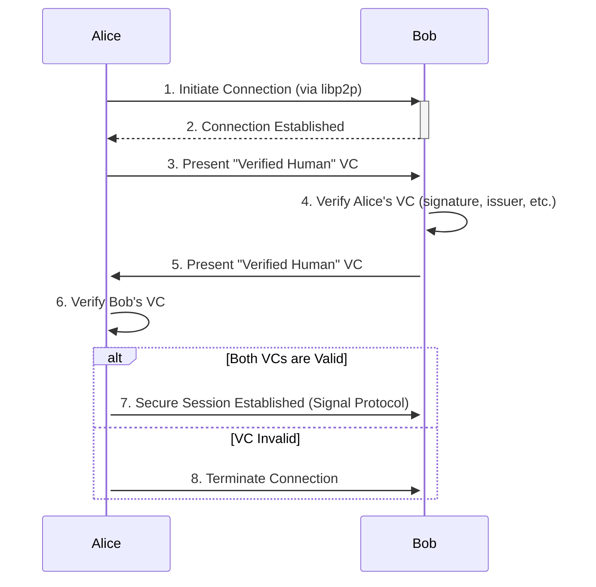
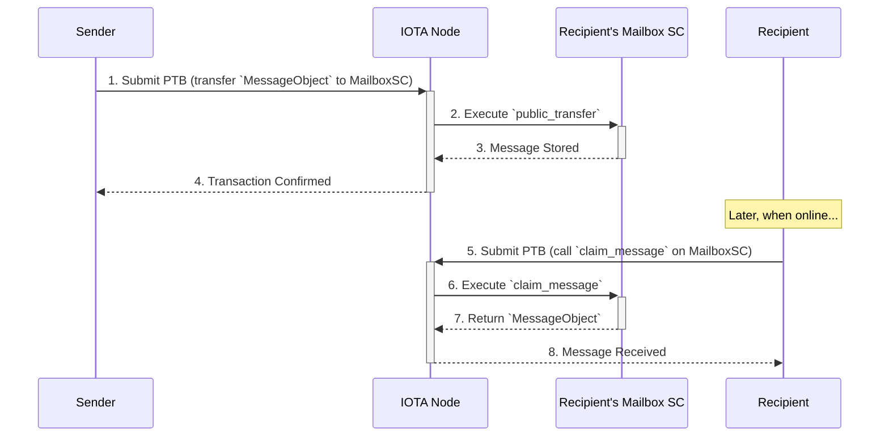

# 06: wot.id - Secure Peer-to-Peer (P2P) Communication

## 1. Overview

This document outlines the architecture for `wot.id`'s secure P2P communication service. It is designed for **verified human-to-human interaction**, emphasizing privacy, user control, and self-sovereign identity. The core principles are direct device-to-device communication, mandatory end-to-end encryption, and user control over all data and keys.

### P2P Communication Stack

The architecture is layered to separate concerns, from the underlying network transport to the application-level messaging protocol.

```mermaid
graph TD
    subgraph Application Layer
        A[wot.id TSP Message]
    end
    subgraph Encryption Layer
        B[Signal Protocol (PQXDH)]
    end
    subgraph Networking Layer
        C[libp2p Transport]
    end

    A -- Encrypted & Authenticated by --> B
    B -- Transmitted over --> C

    style A fill:#d5e8d4
    style B fill:#cde4ff
    style C fill:#f8cecc
```

*   **Layer 1: Networking ([`libp2p`](https://libp2p.io/))**: Provides the foundational P2P transport, handling NAT traversal, peer discovery, and secure channel establishment.
*   **Layer 2: Encryption ([Signal Protocol](https://signal.org/docs/))**: Runs on top of `libp2p` to provide state-of-the-art, post-quantum end-to-end encryption for all message content.
*   **Layer 3: Application (`wot.id` TSP)**: Defines the message structure and business logic for `wot.id` interactions, such as exchanging VCs or chat messages.

---

## 2. Communication Modes

`wot.id` supports two modes of communication to balance real-time interaction with the need for asynchronous messaging.

| Mode                  | Primary Use Case                                | Mechanism                                                               | Latency | Persistence                                     |
|-----------------------|-------------------------------------------------|-------------------------------------------------------------------------|---------|-------------------------------------------------|
| **Off-Chain (P2P)**   | Real-time chat, file transfer                   | Direct device-to-device via `libp2p`                                    | Low     | None (messages only exist on peer devices)      |
| **On-Chain (Mailbox)**| Asynchronous messages, offline delivery         | `Move` smart contract on IOTA L2, interacted with via PTBs                | High    | On-chain (messages stored until claimed/deleted) |

---

## 3. Core Interaction Flows

### 3.1. Flow 1: VC-Gated Handshake (Off-Chain)

Before any communication can occur, peers must perform a handshake to verify each other's identity using a "Verified Human" Verifiable Credential.



### 3.2. Flow 2: Asynchronous Messaging (On-Chain Mailbox)

This flow is used when a recipient is offline. The sender leaves a message in the recipient's on-chain `Mailbox` smart contract.



---

## 4. On-Chain Mailbox: Technical Deep Dive

The optional on-chain mailbox relies on specific IOTA Move smart contract patterns:

*   **Transfer to Object Pattern**: A sender doesn't send a message *to an address* but transfers ownership of a `MessageObject` directly *to the recipient's `MailboxObject` contract*. This is done via the `iota::transfer::public_transfer` function.
*   **Receiving Ticket**: The recipient's `MailboxObject` uses a `Receiving<MessageObject>` ticket to securely claim ownership of the transferred message via the `iota::transfer::public_receive` function.
*   **Dynamic Fields**: The `MailboxObject` uses dynamic object fields (`iota::dynamic_object_field`) to store an arbitrary number of `MessageObject`s, providing flexible and gas-efficient storage.
*   **Capabilities Pattern**: Access to mailbox functions (like claiming or deleting messages) is controlled by a `MailboxOwnerCap` capability object, ensuring only the true owner can manage the mailbox.

These patterns leverage functionalities provided by IOTA's Move environment and standard libraries (see general [IOTA Move Overview](https://docs.iota.org/developer/iota-101/move-overview) and [The Move Language Book](https://move-language.github.io/move/)).

---

## 5. Post-Quantum Cryptography (PQC) Strategy

To ensure long-term security against quantum adversaries, `wot.id` adopts a comprehensive PQC strategy:

*   **Key Exchange (E2EE)**: **CRYSTALS-Kyber** is integrated into the Signal Protocol's key exchange mechanism (PQXDH) for quantum-resistant key establishment.
*   **Digital Signatures**: **CRYSTALS-Dilithium** or **Falcon** will be used for signing Verifiable Credentials and `wot.id` TSP messages. Verification of signatures using these PQC algorithms will primarily occur off-chain. If on-chain smart contracts need to ascertain the validity or status of such VCs or messages, it will be based on associated data verifiable with classic cryptography (e.g., commitments, or co-signatures if applicable) until direct on-chain PQC verification is supported by the IOTA Move VM.
*   **DID Authentication**: `VerificationMethod` entries in DID documents will support PQC keys and signature schemes. It is important to note that, currently, the IOTA Move VM supports classical signature schemes (e.g., Ed25519, Secp256k1) for on-chain verification. Therefore, any on-chain operations requiring DID authentication by a smart contract (such as authorizing updates to a DID document managed by the `Identity` contract) must utilize these supported classical schemes. PQC-based DID authentication will be verified off-chain or through mechanisms like oracles until broader PQC algorithm support is available on-chain.

This hybrid approach, combining classical algorithms for on-chain smart contract interactions and post-quantum algorithms for off-chain communication and data integrity, provides robust security during the transition period and acknowledges current on-chain limitations.
