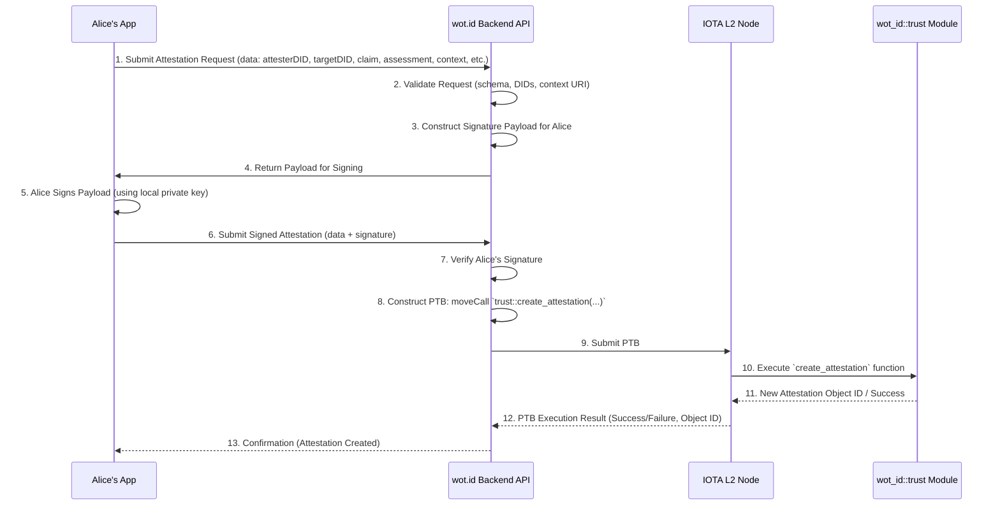

# 07: wot.id - Comprehensive Trust Architecture

## 1. Introduction and Core Philosophy

The `wot.id` trust architecture provides a nuanced, robust, and transparent framework for establishing and assessing trust in a decentralized identity system. It is designed to be flexible enough to cater to diverse use cases while maintaining a consistent and understandable model of trust, deeply integrated with IOTA's capabilities.

### 1.1. Core Principles

1.  **Dual Trust Model**: Addresses both Entity-Relational Trust and Claim-Level Trust.
2.  **Universal Trust Scale**: A standardized numerical scale (0.000-100.000, stored as `u64` 0-100000 on-chain) for consistent interpretation.
3.  **Context-Dependence**: Trust is always evaluated within a specific, URI-defined context.
4.  **Transparency and Verifiability**: Leveraging IOTA L2 for on-chain, verifiable trust assertions.
5.  **Actor Agnosticism with Clear Identifiability**: Trust applies to any DID-identified entity, with mechanisms to infer actor type (human, bot, service).
6.  **Post-Quantum Security**: Adherence to PQC strategy (e.g., CRYSTALS-Dilithium, Falcon for signatures) for long-term integrity.

### 1.2. The Universal Trust Scale

A consistent scale is crucial for interoperability and clear interpretation of trust values.

*   **Scale Range**: **0.000 to 100.000**.
*   **On-Chain Representation (`u64`)**: Multiply by 1,000 (e.g., `85.525` -> `85525`). Effective range `0` to `100000`.

*   **Mapping Qualitative Assessments to Numerical Ranges**:

    | Qualitative Assessment | Universal Scale Range | `u64` Range      | Description                                                                 |
    |------------------------|-----------------------|------------------|-----------------------------------------------------------------------------|
    | **Absolute Distrust**  | 0.000                 | 0                | Confirmed untrustworthy, proven false, or actively malicious.               |
    | **No Trust / Unknown** | 0.001 - 10.000        | 1 - 10000        | No basis for trust, entirely unknown, or highly speculative.                |
    | **Very Low Trust**     | 10.001 - 30.000       | 10001 - 30000    | Minimal indications of trustworthiness, significant doubts remain.          |
    | **Low Trust**          | 30.001 - 50.000       | 30001 - 50000    | Some positive indicators, but insufficient for reliance in critical contexts. |
    | **Moderate Trust**     | 50.001 - 70.000       | 50001 - 70000    | A reasonable basis for trust, generally considered reliable.                |
    | **High Trust**         | 70.001 - 90.000       | 70001 - 90000    | Strong evidence of trustworthiness, reliable for most purposes.             |
    | **Very High Trust**    | 90.001 - 99.999       | 90001 - 99999    | Exceptionally strong evidence, verified through multiple robust methods.    |
    | **Absolute Trust**     | 100.000               | 100000           | Irrefutably true, cryptographically certain, or system-level ground truth.  |

---

## 2. On-Chain Trust Data Model (IOTA Move Contracts)

The `wot.id` trust architecture is realized through several core Move smart contract modules deployed on the IOTA L2. These modules define the structure and relationships of trust-related objects.

### 2.1. Entity-Relationship Diagram (ERD)

```mermaid
erDiagram
    CREDENTIAL {
        string id PK "Credential ID (UID)"
        string issuer_did "Issuer's DID"
        string subject_did "Subject's DID"
        u64 issuance_date
        u64 expiration_date "Option<u64>"
        string type "e.g., VerifiableCredential"
        Proof proof "Embedded Proof object"
        vector_claims "Vector of Claim objects"
    }

    CLAIM {
        string name PK "Claim Name (unique within Credential)"
        string value
        string value_type
        u64 trust_level "Claim's intrinsic trust (0-100000)"
        string verification_method "Option<string>"
        u64 last_verified "Option<u64>"
        string context "Option<string> URI"
    }

    TRUST_RELATIONSHIP {
        string id PK "Relationship ID (UID)"
        string source_did "DID of trust source"
        string target_did "DID of trust target"
        u64 trust_level "Overall trust (0-100000)"
        string context_uri "Context of this relationship"
        vector_evidence "Vector of Evidence objects"
        u64 established
        u64 last_updated
        u64 expires "Option<u64>"
        u8 status "0:Active, 1:Suspended, 2:Revoked"
    }

    ATTESTATION {
        string id PK "Attestation ID (UID)"
        string attester_did "Attester's DID"
        string target_credential_id "FK to CREDENTIAL.id"
        string target_claim_name "FK to CLAIM.name"
        string statement "Option<string>"
        u64 trust_assessment "Attester's view (0-100000)"
        string context_uri "Context of this attestation"
        string signature "Attester's signature"
        u64 timestamp
        u64 expires "Option<u64>"
        u8 status "0:Active, 1:Suspended, 2:Revoked"
    }

    CLAIM_TRUST {
        string id PK "ClaimTrust ID (UID)"
        string credential_id "FK to CREDENTIAL.id"
        string claim_name "FK to CLAIM.name"
        string assessor_did "Assessor's DID (can be subject or 3rd party)"
        u64 trust_level "Aggregated trust (0-100000)"
        string context_uri "Context of this assessment"
        vector_attestation_ids "Vector of ATTESTATION.id (UIDs)"
        string rationale "Option<string>"
        u64 established
        u64 last_updated
        u64 expires "Option<u64>"
        u8 status "0:Active, 1:Suspended, 2:Revoked"
    }

    CONTEXT_DEFINITION {
        string uri PK "Context URI"
        string label
        string description "Option<string>"
        string parent_uri "Option<string> FK to CONTEXT_DEFINITION.uri"
    }

    PROOF {
        string type "e.g., Ed25519Signature2020, Dilithium2Signature2023"
        u64 created
        string verification_method "DID URL of signing key"
        string proof_purpose "e.g., assertionMethod"
        string proof_value "Signature string"
    }

    EVIDENCE {
        string type "e.g., DocumentVerification"
        string source_uri "Option<string> URL to external evidence"
        string description "Option<string>"
        string data "Option<string> Embedded evidence (JSON)"
        u64 timestamp
    }

    CREDENTIAL ||--o{ CLAIM : contains
    TRUST_RELATIONSHIP ||--o{ EVIDENCE : has
    ATTESTATION }o--|| CREDENTIAL : attests_to_claim_in
    ATTESTATION }o--|| CLAIM : attests_to_claim
    CLAIM_TRUST ||--o{ ATTESTATION : supported_by
    CLAIM_TRUST }o--|| CREDENTIAL : assesses_claim_in
    CLAIM_TRUST }o--|| CLAIM : assesses_claim
    CONTEXT_DEFINITION }o--|| CONTEXT_DEFINITION : has_parent
```

### 2.2. Core Move Struct Definitions

These definitions reside primarily within the `wot_id::trust` and `wot_id::credentials` modules.

**Module: `wot_id::trust`**

```move
module wot_id::trust {
    use std::string::{String};
    use std::option::{Option};
    use std::vector;
    use sui::object::{UID};
    // Potentially: use wot_id::identity::{Identity}; // For DID validation if needed

    /// Trust relationship between actors (DIDs)
    struct TrustRelationship has key {
        id: UID,
        source_did: String,         // DID of source (who is trusting)
        target_did: String,         // DID of target (who is trusted)
        trust_level: u64,           // Scaled 0-100000 (0.000-100.000)
        context_uri: String,        // URI identifying the domain of trust
        evidence_uris: vector<String>, // URIs/UIDs to Evidence objects or external links
        established_ts: u64,
        last_updated_ts: u64,
        expires_ts: Option<u64>,
        status: u8,                 // 0: Active, 1: Suspended, 2: Revoked
    }

    /// Represents an attestation about a specific claim in a Credential
    struct Attestation has key {
        id: UID,
        attester_did: String,
        target_credential_id: String, // UID of the Credential object
        target_claim_name: String,    // Name of the claim being attested
        statement: Option<String>,
        trust_assessment: u64,      // Attester's trust for the claim (0-100000)
        context_uri: String,        // URI for the context of this attestation
        signature: String,          // Cryptographic signature by attester_did.
                                    // Standardized payload (see doc for details)
        timestamp_ts: u64,
        expires_ts: Option<u64>,
        status: u8,                 // 0: Active, 1: Suspended, 2: Revoked
    }

    /// Consolidated trust assessment about a specific claim, potentially aggregating Attestations
    struct ClaimTrust has key {
        id: UID,
        credential_id: String,      // UID of the Credential object
        claim_name: String,
        assessor_did: String,       // DID making this assessment (can be subject or 3rd party)
        trust_level: u64,           // Overall trust for the claim (0-100000)
        context_uri: String,        // URI for the context
        supporting_attestation_ids: vector<String>, // UIDs of Attestation objects
        rationale: Option<String>,
        established_ts: u64,
        last_updated_ts: u64,
        expires_ts: Option<u64>,
        status: u8,                 // 0: Active, 1: Suspended, 2: Revoked
    }

    /// Defines a specific context for trust assessment
    struct ContextDefinition has key {
        id: UID, // Internal object ID
        uri: String,                // Unique, queryable URI for the context
        label: String,              // Human-readable label
        description: Option<String>,
        parent_uri: Option<String>, // URI of an optional parent context for hierarchy
    }

    // Functions for creating, updating, and querying these objects will be defined here.
    // e.g., public fun create_attestation(...): Attestation { ... }
    // e.g., public fun update_trust_relationship(...) { ... }
}
```

**Module: `wot_id::credentials` (relevant supporting structs)**

```move
module wot_id::credentials {
    use std::string::{String};
    use std::option::{Option};
    use std::vector;
    use sui::object::{UID};

    /// Represents a single piece of information within a Credential.
    struct Claim has store, drop { // Not 'key' as it's embedded
        name: String,
        value: String,
        value_type: String,         // e.g., "xsd:string", "xsd:integer", "DID"
        trust_level: u64,           // Intrinsic trust of this claim as stated by issuer (0-100000)
        verification_method: Option<String>, // Optional key for direct claim verification
        last_verified_ts: Option<u64>,
        context_uri: Option<String>, // Optional URI for this claim's specific trust context
    }

    /// Defines the cryptographic proof for a Credential.
    struct Proof has store, drop { // Not 'key' as it's embedded
        type: String,           // e.g., "Ed25519Signature2020", "Dilithium2Signature2023"
        created_ts: u64,
        verification_method: String, // DID URL of the signing key (e.g., did:example:123#key-1)
        proof_purpose: String,  // e.g., "assertionMethod", "authentication"
        proof_value: String,    // The base64url-encoded signature value
    }

    /// Provides supporting information for trust assertions.
    struct Evidence has store, drop { // Could be an object with 'key' if managed independently
        type: String,           // e.g., "DocumentVerification"
        source_uri: Option<String>, // Link to external evidence (URL/URI)
        description: Option<String>,
        data: Option<String>,   // Embedded evidence data (e.g., JSON string, IPFS CID)
        timestamp_ts: u64,
    }

    /// Represents a Verifiable Credential.
    struct Credential has key {
        id: UID,
        issuer_did: String,
        subject_did: String,
        issuance_date_ts: u64,
        expiration_date_ts: Option<u64>,
        type: vector<String>,       // e.g., ["VerifiableCredential", "UniversityDegreeCredential"]
        claims: vector<Claim>,      // Embedded claims
        proof: Proof,               // Embedded proof
        // Potentially other fields like credentialSchema, termsOfUse, etc.
    }

    // Functions for issuing, revoking, verifying credentials.
}
```

---

## 3. Trust Interaction Flows and PTB Usage

This section details how trust is established and updated through interactions, primarily focusing on attestations and the role of Programmable Transaction Blocks (PTBs).

### 3.1. Attestation Creation and Submission Flow

This sequence diagram illustrates a common flow where a user (Alice) creates an attestation for another user (Bob) via the `wot.id` Backend API, which then commits it to the IOTA L2.



### 3.2. Example PTB for Creating an Attestation

The Backend API, using the `iota-sdk` (Rust), would construct a PTB similar to this conceptual example:

```json
// Conceptual JSON representation of a PTB for creating an Attestation
{
  "transactions": [
    {
      "type": "Transaction",
      "essence": {
        "type": "RegularTransactionEssence",
        "networkId": "iota-rebased-network-id", // From network info
        "inputs": [
          // Inputs for gas payment, selected by SDK/Backend
          { "type": "UTXOInput", "transactionId": "...", "transactionOutputIndex": 0 }
        ],
        "outputs": [
          // Outputs for change, new Attestation object, etc.
          { "type": "BasicOutput", "amount": "...", "address": "..." } // Change
        ],
        "payload": {
          "type": "TaggedDataPayload",
          "tag": "PTB", // Or a more specific tag
          "data": {
            "commands": [
              {
                "type": "MoveCall",
                "packageObjectId": "0xWOT_ID_TRUST_PACKAGE_ID", // Deployed package ID
                "module": "trust",
                "function": "create_attestation",
                "typeArguments": [],
                "arguments": [
                  { "type": "Pure", "value": "did:iota:alice..." }, // attester_did (String)
                  { "type": "Pure", "value": "0xCREDENTIAL_OBJECT_ID" }, // target_credential_id (ObjectID or String UID)
                  { "type": "Pure", "value": "skillLevel" }, // target_claim_name (String)
                  { "type": "Pure", "value": "Alice's statement about Bob's skill" }, // statement (Option<String>)
                  { "type": "Pure", "value": 95000 }, // trust_assessment (u64)
                  { "type": "Pure", "value": "urn:wot.id:context:professional:skill:move" }, // context_uri (String)
                  { "type": "Pure", "value": "alice_signature_base64url" }, // signature (String)
                  { "type": "Pure", "value": 1678886400000 } // timestamp_ts (u64)
                  // expires_ts (Option<u64>) would be another argument if provided
                ]
              }
              // Potentially other commands, e.g., updating a ClaimTrust object
            ]
          }
          "type": "wot.id/attestationRequest",
          "version": "1.0",
          "subjectDid": "did:iota:0xb0b...",
          "contextUri": "urn:wot.id:context:event:conference2025",
          "suggestedClaimName": "skill:publicSpeaking"
        }
        ```
    *   Bob's app generates this QR code for Alice to scan.

2.  **QR Code Scanning & Attestation Initiation (Alice's Device - Attester):**
    *   Alice's `wot.id` app scans the QR code and parses the JSON payload.
    *   The app verifies the `type` and `version` to ensure compatibility.
    *   It then presents an interface to Alice, pre-filled with Bob's DID (`subjectDid`), the `contextUri`, and the `suggestedClaimName` (if provided).

3.  **Attestation Creation (Alice's Device - Attester):**
    *   Alice's app allows her to:
        *   Confirm or modify the `contextUri`.
        *   Confirm or specify the `target_claim_name` she is attesting to. If it's a general attestation about Bob in that context, this might be a predefined "presence" or "general_interaction" claim.
        *   Set her `trust_assessment` for the claim or subject using the Universal Trust Scale (e.g., via a slider or predefined levels).
        *   Add an optional `statement` (text comment).
        *   Review the attestation details.
    *   Once confirmed, Alice's app constructs an `Attestation` object (or a similar off-chain signed data structure). This involves:
        *   Setting `attester_did` to Alice's DID.
        *   Populating fields based on her input and the QR data.
        *   Generating a `timestamp`.
        *   Calculating the standardized hash of the attestation content and signing it using Alice's private key associated with her DID. The `signature` and `verification_method` (her DID URL key identifier) are added.

4.  **Attestation Submission & Storage (Alice's Device - Attester):**
    *   Alice's app then needs to submit/store this attestation. Options include:
        *   **Direct On-Chain Submission**: If Alice's app has the capability (and Alice has funds for gas), it could construct a PTB with a `moveCall` to the `wot_id::credentials` module's `create_attestation` function and submit it to an IOTA node via the Backend API or directly. This provides immediate on-chain verifiability.
        *   **Submission via Backend API**: Alice's app sends the signed attestation data to the `wot.id` Backend API. The Backend API then validates it, constructs the PTB, and submits it to the IOTA L2. This is a common pattern for mobile clients.
        *   **Local Storage / Batching (Off-Chain First)**: Alice's app stores the signed attestation locally. It can be shared directly with Bob (e.g., via Bluetooth/NFC if he needs an immediate off-chain copy) or batched with other attestations for later submission to the Backend API or on-chain. This is useful for offline scenarios or to save on transaction fees.
        *   **Callback Submission**: If a `callbackUrl` was provided in the QR, Alice's app could POST the signed attestation to that URL (which might be an endpoint controlled by Bob or a trusted intermediary).

**Online/Offline Considerations:**

*   **QR Generation & Scanning**: Can be fully offline.
*   **Attestation Creation & Signing**: Can be fully offline, as it only requires Alice's local DID, private keys, and app logic.
*   **Attestation Submission**:
    *   Direct on-chain submission or submission via the main `wot.id` Backend API requires an internet connection.
    *   Local storage for batching is ideal for offline scenarios. The attestations can be synced when connectivity is restored.
    *   Peer-to-peer sharing of locally signed attestations (e.g., Alice gives Bob a copy of her attestation about him directly) can also occur offline.

This mobile-to-mobile flow, facilitated by QR codes, provides a user-friendly way to generate verifiable attestations in real-world interactions, forming a crucial part of `wot.id`'s practical trust management.


### 3.3. Web-Based Attestations

Web applications and services can also participate in the `wot.id` trust ecosystem by enabling users to make attestations or by issuing attestations themselves. This often involves a user interacting with a web interface that integrates with their `wot.id` identity.

**Scenarios for Web-Based Attestations:**

1.  **User-to-User/User-to-Content Attestation via Web UI:**
    *   A user (Attester) logged into a `wot.id`-enabled web platform (e.g., a community forum, a project collaboration tool, a review site) wants to attest to the quality of another user's contribution, the accuracy of a piece of content, or their trust in another user within that platform's context.
    *   The web platform provides an interface (e.g., a button "Attest with wot.id") that, when clicked, initiates the attestation process.

2.  **Service-Issued Attestations about User Activity:**
    *   A web service (e.g., an e-learning platform, an online marketplace, a code repository) attests to a user's achievement or status (e.g., "User X completed Course Y," "User Z has a 5-star seller rating," "User A contributed code to Project B").
    *   These attestations are typically generated by the service based on verified user activity within the platform.

**Technical Flow (User-Initiated Attestation via Web UI):**

1.  **User Interaction & Intent:**
    *   The Attester (e.g., Alice) is logged into a web platform using her `wot.id` identity (or an account linked to it).
    *   She interacts with content or a user profile (e.g., Bob's article) and decides to make an attestation.
    *   She clicks an "Attest" button associated with the subject (Bob's article or Bob himself).

2.  **Attestation Parameters Collection:**
    *   The web platform gathers necessary information:
        *   `subjectDid` or `subjectIdentifier`: The DID of the user being attested to, or an identifier for the content.
        *   `contextUri`: The context of the platform or specific interaction (e.g., `"urn:wot.id:context:platform:forumX:articleReview"`).
        *   `suggestedClaimName` (Optional): Pre-filled by the platform (e.g., `"contentAccuracy"`, `"userHelpfulness"`).
    *   The platform presents a form/modal to Alice to:
        *   Confirm/refine the claim and context.
        *   Provide her `trust_assessment` (Universal Trust Scale).
        *   Add an optional `statement`.

3.  **Interfacing with User's `wot.id` Wallet/Agent:**
    *   To sign the attestation, the web platform needs to interact with Alice's `wot.id` wallet or a browser extension acting as her agent. This can be achieved through:
        *   **WalletConnect-like Protocol**: The web platform displays a QR code or deep link that Alice's `wot.id` mobile wallet can scan/open to authorize the signing of the pre-filled attestation data.
        *   **Browser Extension**: If Alice has a `wot.id` browser extension, the web platform can send an attestation signing request to the extension, which then prompts Alice for confirmation.
    *   The attestation data (payload to be signed) is securely passed to Alice's wallet/agent.

4.  **Attestation Signing (Alice's Wallet/Agent):**
    *   Alice's wallet/agent displays the attestation details for final review.
    *   Upon her approval, the wallet/agent signs the attestation payload using Alice's private key associated with her `attester_did`.
    *   The signed attestation (including the signature and `verification_method`) is returned to the web platform.

5.  **Attestation Submission & Storage:**
    *   The web platform receives the signed attestation.
    *   It can then:
        *   Submit it to the `wot.id` Backend API for on-chain anchoring.
        *   Store it in its own database and make it visible within the platform.
        *   Offer it to the Subject (Bob) for their records.

**Technical Flow (Service-Issued Attestation):**

1.  **Triggering Event:** A verifiable event occurs on the web service (e.g., course completion).
2.  **Attestation Generation:** The service's backend:
    *   Identifies the `subjectDid` (the user who achieved something).
    *   Defines the `target_claim_name` (e.g., `"courseCompletion:CourseID"`).
    *   Sets the `trust_assessment` (often 100.000 if it's a factual, verifiable event by the service).
    *   Uses its own service DID (`attester_did`) to sign the attestation.
3.  **Delivery/Storage:**
    *   The service can offer the signed attestation to the user as a downloadable Verifiable Credential or `Attestation` object.
    *   It might anchor a hash of the attestation on-chain for public verifiability.
    *   It can submit the full attestation to the `wot.id` Backend API if it's meant to be broadly discoverable (and if the user consents).

Web-based attestations bridge the gap between traditional web interactions and the decentralized trust fabric of `wot.id`, allowing trust to be built and recognized across diverse online experiences.

### 3.4. Automated Attestations from Services

Beyond user-initiated actions, `wot.id` supports scenarios where services or automated systems issue attestations based on predefined logic, data analysis, or observed events. These automated attestations can play a crucial role in maintaining up-to-date trust indicators and reflecting real-time system states.

**Scenarios for Automated Attestations:**

1.  **System Health & Monitoring Services:**
    *   A monitoring service attests to the uptime, performance, or security status of another service or infrastructure component.
    *   Example: A service `did:iota:monitoringService` attests that `did:iota:apiService` had "99.99% uptime" in the context `"urn:wot.id:context:serviceHealth:last24Hours"`.

2.  **Data Validation & Oracle Services:**
    *   An oracle service attests to the validity or current value of off-chain data.
    *   Example: An oracle `did:iota:weatherOracle` attests that the "temperature in Berlin" was "25°C" at a specific timestamp, in the context `"urn:wot.id:context:data:weather:berlin"`.

3.  **IoT Device Reporting:**
    *   An IoT device (with its own DID) attests to sensor readings or its operational state.
    *   Example: `did:iota:tempSensor123` attests that its "currentReading" is "15.5" (degrees Celsius) in context `"urn:wot.id:context:iot:environment:roomA"`.

4.  **Compliance & Audit Systems:**
    *   An automated audit system attests that a particular entity or process meets certain compliance criteria based on continuous checks.
    *   Example: `did:iota:complianceAuditor` attests that `did:iota:financeProcessXYZ` "passed daily audit" in context `"urn:wot.id:context:compliance:financial:dailyCheck"`.

**Technical Considerations:**

1.  **Service DID & Key Management:**
    *   The automated service must have its own DID (`attester_did`) and securely manage the associated private keys for signing attestations. Hardware Security Modules (HSMs) or other secure key management solutions are often recommended for services issuing high-value or frequent attestations.

2.  **Triggering Logic:**
    *   Clear, auditable logic must define when and how an automated attestation is generated (e.g., cron jobs, event-driven triggers, threshold breaches).

3.  **Data Sources & Integrity:**
    *   The data upon which the automated attestation is based must be reliable and its integrity maintained.

4.  **Attestation Construction & Signing:**
    *   The service's backend constructs the `Attestation` object or a signed data payload, populating fields like `target_claim_name`, `trust_assessment` (often 100.000 if it's a factual report from the service's perspective), `context`, and `statement` (which might include raw data or a summary).
    *   It signs the attestation using its service DID's private key.

5.  **Submission & Dissemination:**
    *   **Direct On-Chain Anchoring**: For high transparency, the service can submit attestations (or their hashes) directly to the IOTA L2 via PTBs. This is suitable for public data or critical status updates.
    *   **API Exposure**: The service might expose an API endpoint where other services or users can query for the latest attestations.
    *   **Push to Subscribers**: Services could push attestations to subscribed DIDs or systems that rely on the attested information.
    *   **Integration with `wot.id` Backend**: Automated attestations can be submitted to the `wot.id` Backend API to become part of the broader discoverable trust graph, subject to relevance and system policies.

6.  **Frequency & Volume:**
    *   Automated services can generate a high volume of attestations. Strategies for batching on-chain submissions, using off-chain caches, or summarizing attestations might be necessary to manage costs and network load.

7.  **Revocation & Updates:**
    *   Mechanisms must be in place for the automated service to update or revoke its attestations if the underlying data or state changes (e.g., a service that was "up" is now "down").

Automated attestations from services provide a scalable way to inject real-time, data-driven trust signals into the `wot.id` ecosystem, supporting a wide range of applications from infrastructure monitoring to decentralized oracles.


## 4. Trust Aggregation and Computation Models

While individual attestations and direct trust assertions provide valuable data points, the true power of a trust framework lies in its ability to aggregate these diverse inputs into a consolidated trust assessment. This section outlines the principles and potential models for trust aggregation and computation within `wot.id`. The goal is to derive a more holistic and reliable trust score for a given subject (entity or claim) within a specific context.

### 4.1. Core Principles of Trust Aggregation

1.  **Context Specificity**: Aggregation must always occur within a defined `contextUri`. Trust scores are not universally transferable without re-evaluation in a new context.
2.  **Input Diversity**: The system should be capable of incorporating various trust indicators:
    *   Direct attestations from multiple parties.
    *   Transitive trust (trust in an attester influencing the weight of their attestation).
    *   Self-asserted credentials (claims made by the subject themselves).
    *   Evidence linked to claims or attestations.
3.  **Configurability & Transparency**: While default aggregation models can be provided, the mechanisms should ideally be configurable by the relying party or application. The process should be as transparent as possible, allowing users to understand how a trust score was derived.
4.  **Dynamic & Evolving**: Trust is not static. Aggregation models should account for the age of attestations (decay), the evolving reputation of attesters, and the potential for revocation or updates.
5.  **Conflict Resolution**: Mechanisms should be considered for handling conflicting attestations or trust signals.

### 4.2. Input Data for Aggregation

The primary inputs for trust aggregation include:

*   **A Collection of `Attestation` Objects**: Relevant attestations targeting a specific `subjectDid` (or `target_credential_id` and `target_claim_name`) within a given `contextUri`. Each attestation includes:
    *   `attester_did`: The DID of the entity making the attestation.
    *   `trust_assessment`: The attester's stated trust level (0-100000).
    *   `timestamp`: When the attestation was made.
    *   `expires` (Optional): Expiry date of the attestation.
    *   `statement` (Optional): Supporting text.
*   **Reputation of Attesters**: A computed or asserted trust score for each `attester_did` within the relevant context. This introduces a recursive element to trust computation.
*   **Direct Trust Links**: If the querying entity has a direct, privately held trust assessment for the subject.
*   **Claim-Specific Parameters**: Any parameters defined for the specific `target_claim_name` that might influence aggregation (e.g., inherent volatility of the claim).

### 4.3. Basic Aggregation Models (Illustrative Examples)

The actual implementation of aggregation can vary in complexity. Below are some illustrative models:

1.  **Simple Averaging:**
    *   **Description**: Calculates the arithmetic mean of `trust_assessment` values from all relevant, non-expired attestations.
    *   **Formula (Conceptual)**: `AggregatedTrust = Σ(trust_assessment_i) / N` (where N is the number of attestations).
    *   **Pros**: Simple to implement and understand.
    *   **Cons**: Treats all attestations equally, regardless of attester reputation or age. Susceptible to Sybil attacks if attester reputation is not factored in.

2.  **Weighted Averaging by Attester Reputation:**
    *   **Description**: Weights each `trust_assessment` by the reputation of its `attester_did`.
    *   **Formula (Conceptual)**: `AggregatedTrust = Σ(trust_assessment_i * attester_reputation_i) / Σ(attester_reputation_i)`.
    *   **Pros**: Gives more influence to trusted attesters.
    *   **Cons**: Requires a reliable way to determine attester reputation.

3.  **Recency-Weighted Averaging (Time Decay):**
    *   **Description**: Gives more weight to recent attestations, with the influence of older attestations decaying over time.
    *   **Formula (Conceptual)**: Involves applying a decay function (e.g., exponential decay) to the weight of each attestation based on its age. `Weight_i = f(current_time - timestamp_i)`.
    *   **Pros**: Reflects the potentially changing nature of trust and information.
    *   **Cons**: Choosing an appropriate decay function and rate can be challenging.

4.  **Majority Threshold / Consensus:**
    *   **Description**: For boolean-like claims (e.g., "is_member_of_X"), trust is established if a certain percentage of reputable attesters agree.
    *   **Pros**: Useful for specific types of claims.
    *   **Cons**: Less applicable to nuanced trust levels on the universal scale.

### 4.4. Contextual Adjustments

Beyond algorithmic aggregation, the system or relying application might apply further adjustments based on:

*   **Criticality of the Context**: Higher stakes might require more stringent thresholds or a greater number of corroborating attestations.
*   **Relying Party's Risk Profile**: A risk-averse relying party might discount scores or require higher confidence levels.
*   **External Factors**: Information outside the direct set of attestations that might influence the interpretation of trust.

### 4.5. Output of Aggregation

The output of the trust aggregation process is typically:

*   A **Computed Trust Score**: A single value on the Universal Trust Scale (0-100000) for the subject/claim in the given context.
*   **Confidence Level/Supporting Evidence**: Metadata indicating the strength of the computation (e.g., number of attestations, overall reputation of sources).
*   **Breakdown (Optional)**: For transparency, a list of the primary inputs and how they contributed to the final score.

### 4.6. Future Considerations

*   **Advanced Models**: Exploring more sophisticated aggregation techniques, potentially incorporating Bayesian networks, fuzzy logic, or machine learning models trained on trust patterns.
*   **Personalization**: Allowing users to define their own trust policies and aggregation preferences.
*   **Explainability**: Enhancing the ability to explain *why* a certain trust score was computed.


## 5. Key Trust Dynamics and System Rules

These rules govern how trust is established, propagated, and maintained.

*   **Default Inheritance**: Claims may initially inherit a base trust level from the verifier's trust in the credential issuer (primarily an off-chain guiding principle).
*   **Verification Boosting**: Direct verification of a claim can increase its specific `trust_level` (e.g., updating `Claim.trust_level` or `ClaimTrust.trust_level`). `Claim.verification_method` and `Claim.last_verified` track this. If direct verification implies an on-chain smart contract action and the `Claim.verification_method` refers to a PQC scheme, this verification is subject to the current limitations of the IOTA Move VM (i.e., it would typically be an off-chain validated update recorded on-chain, or the claim must use a classically verifiable signature if on-chain cryptographic proof by the contract is required).
*   **Temporal Decay (On-Chain)**:
    *   Trustworthiness of unverified/un-updated claims/relationships may diminish.
    *   On-chain Move contract logic will handle decay calculations or updates based on `last_updated`/`last_verified` fields.
    *   Decay parameters may be configurable. Re-verification resets the baseline.
*   **Claim Trust Aggregation**: Optional on-chain helper functions may assist assessors in determining `ClaimTrust.trust_level` from `supporting_attestations`. The `assessor_did` retains final authority.
*   **Explicit Revocation of Trust Objects**:
    *   `TrustRelationship`, `Attestation`, `ClaimTrust`, and `Credential` objects include a `status: u8` field (0: Active, 1: Suspended, 2: Revoked).
    *   Authority to change status resides with the object's controller (e.g., `source` for `TrustRelationship`, issuer for `Credential`).
    *   On-chain functions manage status transitions.
*   **Zero-Knowledge Proof (ZKP) Interaction**:
    *   ZKPs affirm claim *validity* (e.g., issued by X, not revoked) without revealing data.
    *   Successful ZKP verification can update `Claim.last_verified`, preventing authenticity-related trust decay. It generally doesn't directly set the `trust_level` of hidden content.


## 6. On-Chain Implementation with IOTA L2

The on-chain components of the `wot.id` trust architecture are implemented as [IOTA Move smart contracts](https://docs.iota.org/smart-contracts/overview) deployed on the IOTA Layer 2 network. Interactions with these contracts are orchestrated via [IOTA Programmable Transaction Blocks (PTBs)](https://docs.iota.org/smart-contracts/guide/core_concepts/transactions#programmable-transaction-blocks-ptbs), primarily constructed and submitted by the `wot.id` Backend API using the [Rust `iota-sdk`](https://github.com/iotaledger/iota-sdk/tree/develop/sdk).

### 6.1. Core Move Smart Contracts for Trust Objects

The fundamental trust entities—such as Trust Relationships, Attestations, Claims, Claim Trust assessments, and Context Definitions—are represented as Move structs within dedicated modules like `wot_id::credentials` and `wot_id::context_registry`. The design of these structs leverages several standard IOTA Move smart contract patterns to ensure security, flexibility, and proper ledger state management:

1.  **Object Model (`key`, `store` abilities):**
    *   **Top-Level Objects (`key` ability):** Structs like `TrustRelationship`, `ClaimTrust`, and `ContextDefinition` are defined with the `key` ability. This makes them first-class citizens on the ledger, each uniquely identifiable by a `UID` and typically owned by the DID that created them or is responsible for them (e.g., the `source` DID for a `TrustRelationship`, or a designated module-controlled account for `ContextDefinition`s).
    *   **Embeddable/Storable Objects (`store`, `drop` abilities):** Structs such as `Attestation` and `Claim` (which is part of a `Credential`) possess the `store` ability (and often `drop`). This allows instances of these structs to be stored within other objects. For example:
        *   `Claim` structs are embedded within a `Credential` object.
        *   `Attestation` structs might be stored within a `ClaimTrust` object (e.g., in a `vector<Attestation>`) or managed in a list within a dedicated log object if they are numerous.
        *   `Evidence` structs are stored within `TrustRelationship` objects.

2.  **Dynamic Fields (`iota::dynamic_field`):**
    *   Dynamic fields provide a flexible way to attach arbitrary data to Move objects without altering their core struct definition. This is particularly useful for:
        *   **Extensible Claim Storage**: Within a `Credential` object, individual `Claim` structs could be stored as dynamic fields, keyed by their `name`. This allows credentials to hold a variable number and type of claims.
        *   **Managing Collections**: A `ClaimTrust` object could use dynamic fields to store references (UIDs) to supporting `Attestation` objects, perhaps keyed by the `attester_did` or a unique attestation identifier.
        *   **Storing Optional Metadata**: Adding supplementary, non-standardized information to trust objects like `TrustRelationship` or `Attestation` as needed.

3.  **Capabilities Pattern:**
    *   The Capabilities pattern is employed to enforce fine-grained access control over sensitive functions that modify trust objects. A "capability" is often a special, non-forgeable Move object (a witness) that must be provided as an argument to a function to authorize its execution.
    *   **Examples in `wot.id`:**
        *   Updating the `trust_level` or `status` (e.g., revoking) of a `TrustRelationship` object might require a capability held by the `source` DID of that relationship.
        *   Revoking an `Attestation` object could require a capability derived from the original `attester_did`.
        *   Modifying or deleting a `ContextDefinition` would require administrative capabilities associated with the `wot_id::context_registry` module.
        *   Issuing or revoking a `Credential` (if managed as an on-chain object) would be restricted to the issuer DID via a capability.

4.  **ID Pointer Pattern (UIDs as References):**
    *   Many trust objects reference others using their unique identifiers (UIDs). This forms a web of linked data on-chain.
    *   **Examples:**
        *   `Attestation::target_credential_id` (a `String` representing a UID) points to a specific `Credential` object.
        *   `ClaimTrust::credential_id` points to a `Credential`.
        *   `ClaimTrust::supporting_attestations` (a `vector<UID>`) contains a list of UIDs pointing to individual `Attestation` objects.
        *   `ContextDefinition::parent_uri` can link to another `ContextDefinition` object's URI (which is its key and part of its UID derivation).
    *   This pattern allows for querying and traversing relationships between trust components on the ledger.

These Move patterns collectively enable a robust and expressive on-chain representation of the `wot.id` trust architecture.

### 6.2. Programmable Transaction Blocks (PTBs) for Trust Operations

All state changes and interactions with the on-chain trust objects are executed via IOTA Programmable Transaction Blocks (PTBs). The `wot.id` Backend API typically uses the Rust `iota-sdk` to construct and submit these PTBs.

1.  **`moveCall` for Trust Functions:**
    *   The primary PTB command for interacting with the trust modules is `moveCall`. This command invokes specific public functions within the deployed Move contracts (e.g., in `wot_id::credentials` or `wot_id::context_registry`).
    *   **Example function calls:**
        *   `wot_id::credentials::create_trust_relationship(source_did_obj, target_did_str, trust_level_u64, context_uri_str, evidence_vec, expires_option_u64)`
        *   `wot_id::credentials::update_trust_relationship_status(relationship_id_obj, new_status_u8, capability_obj)`
        *   `wot_id::credentials::create_attestation(attester_did_obj, target_cred_id_str, target_claim_name_str, trust_assessment_u64, context_uri_str, signature_str, expires_option_u64, statement_option_str)`
            *   **Note on `signature_str`**: The `signature_str` is stored with the attestation object on-chain. Client applications or the Backend API are expected to validate this signature using appropriate cryptographic libraries (including PQC libraries if a PQC scheme is used) *before* submitting the transaction. The Move smart contract itself **does not currently perform cryptographic verification of PQC signatures** due to limitations in the IOTA Move VM. The on-chain contract thus trusts the validity of the signature as asserted by the submitter. This design allows for off-chain verification and future-proofs for potential on-VM PQC support.
        *   `wot_id::context_registry::register_context(admin_cap_obj, uri_str, label_str, description_option_str, parent_uri_option_str)`

2.  **Atomic Execution:**
    *   PTBs bundle multiple commands into a single, indivisible transaction. This atomicity is crucial for maintaining data consistency.
    *   **Example:** A single PTB could atomically:
        1.  Call `wot_id::context_registry::register_context` to define a new operational context.
        2.  Call `wot_id::credentials::create_credential` to issue a new credential object.
        3.  Call `wot_id::credentials::create_attestation` for a claim within that new credential, referencing the newly registered context.
    *   If any command in the sequence fails, the entire transaction is reverted, preventing partial or inconsistent updates to the ledger.

3.  **Chaining Results:**
    *   PTBs allow the output of one command (e.g., a `moveCall` that creates a new object and returns its `UID`) to be used as an input to subsequent commands within the same PTB.
    *   **Example:**
        1.  A `moveCall` to `wot_id::credentials::create_credential(...)` returns the `UID` of the newly created `Credential` object.
        2.  This returned `UID` is then immediately used as the `target_credential_id` input parameter for a subsequent `moveCall` to `wot_id::credentials::create_attestation(...)` within the same PTB.
    *   This enables complex, multi-step workflows to be defined and executed as a single atomic operation.

4.  **Gas Management:**
    *   PTBs offer precise control over transaction gas fees, which is essential for managing operational costs and ensuring reliable execution. The Rust `iota-sdk` provides functions to:
        *   `setGasPrice()`: Specify the price per unit of gas, allowing for transaction prioritization.
        *   `setGasBudget()`: Define the maximum amount of gas the transaction is allowed to consume. This can be determined automatically by the SDK via a dry run or set explicitly.
        *   `setGasPayment()`: Specify the account from which gas fees will be paid.
    *   The `wot.id` Backend API manages these parameters to optimize for cost and confirmation speed when submitting trust-related transactions.

By leveraging these PTB capabilities, `wot.id` ensures that all on-chain trust operations are performed securely, atomically, and efficiently.

## 7. Security, Privacy, and Ethical Considerations

The `wot.id` trust architecture, while powerful, necessitates careful consideration of security, privacy, and ethical implications to ensure responsible and fair operation.

### 7.1. Security Considerations

Robust security measures are paramount to maintain the integrity and reliability of the trust system.

*   **Cryptographic Strength:**
    *   All attestations, credentials, and on-chain trust objects rely on strong digital signatures.
    *   The system is designed with a Post-Quantum Cryptography (PQC) transition strategy in mind, aiming to use algorithms like CRYSTALS-Dilithium for signatures and CRYSTALS-Kyber for KEMs where applicable, to ensure long-term security against quantum threats. (Reference: `06_P2P_Communication.md` for PQC details).
    *   **Important Limitation**: It is crucial to note that, at present, the IOTA Move Virtual Machine does **not** support on-chain cryptographic verification of PQC signature schemes such as CRYSTALS-Dilithium or Falcon. Therefore, any `Attestation` or `Credential` (via its `Proof` field) utilizing PQC signatures must have those signatures verified off-chain (e.g., by the `wot.id` Backend API or client applications) *before* being submitted to or referenced by on-chain Move contracts. The on-chain contracts will store these PQC signatures, enabling robust off-chain verification and future-proofing for potential on-VM PQC support, but they cannot currently enforce their cryptographic validity. For interactions requiring on-chain signature verification directly by Move contracts (e.g., for certain access control mechanisms or DID authentication within a smart contract function), classical signature schemes supported by the IOTA Move VM (such as Ed25519, Secp256k1, Secp256r1, BLS G1/G2 – as detailed in Memory `ca08ebf6-b4ec-496a-ab20-3d2733fc6b51`) must be used.
*   **Secure Key Management:**
    *   Users and services (especially automated ones) must employ secure key management practices for their DIDs. Hardware security modules (HSMs) or secure enclaves are recommended for high-value identities.
    *   Compromise of an attester's key could lead to malicious attestations, underscoring the need for robust key protection and revocation mechanisms.
*   **Input Validation and Sanitization:**
    *   All inputs to Move smart contract functions (e.g., context URIs, statement content, trust values) must be rigorously validated and sanitized to prevent injection attacks or unexpected behavior.
    *   Constraints on string lengths, formats, and numerical ranges (e.g., `trust_level` within 0-100,000) are enforced.
*   **Smart Contract Security:**
    *   Move smart contracts (`wot_id::credentials`, `wot_id::context_registry`, etc.) must undergo thorough security audits by reputable third parties.
    *   Adherence to Move security best practices, formal verification techniques (where feasible), and extensive testing are critical.
*   **Sybil Attack Resistance:**
    *   Trust aggregation models must consider defenses against Sybil attacks, where an attacker creates numerous pseudonymous identities to unfairly influence trust scores. Mechanisms like requiring a cost to create DIDs, reputation systems for attesters, or linking trust to real-world verifiable credentials can mitigate this.
*   **Denial of Service (DoS) Prevention:**
    *   Gas limits and transaction costs on the IOTA L2 provide inherent DoS protection. However, smart contract logic should be efficient to prevent gas exhaustion attacks targeting specific functions.
*   **Replay Attack Prevention:**
    *   Signatures on attestations include timestamps and potentially nonces or sequence numbers within the signed payload to prevent replay attacks. On-chain objects also have unique IDs.

### 7.2. Privacy Considerations

Protecting user privacy is a core tenet, especially when dealing with sensitive trust-related information.

*   **Data Minimization:**
    *   Only essential information required for trust computation and verification should be stored on the public ledger. Sensitive personal data underlying claims should, where possible, remain off-chain.
    *   Attestations should focus on the specific claim and context, avoiding unnecessary data exposure.
*   **Selective Disclosure and Zero-Knowledge Proofs (ZKPs):**
    *   While trust scores and attestations about public claims are generally public, ZKPs can be used to prove possession of a credential or the validity of a specific claim within it without revealing the claim's actual content. This enhances privacy for underlying data.
    *   The `wot.id` architecture supports ZKP interaction for claim verification, which can update `Claim.last_verified` without exposing claim details.
*   **Pseudonymity and DID Management:**
    *   DIDs offer pseudonymity. Users can create multiple DIDs for different contexts to segregate their interactions and limit linkability.
    *   However, the public nature of on-chain attestations means that patterns of interaction associated with a DID can be analyzed.
*   **Transparency of Data Usage:**
    *   The system's documentation and user interfaces should clearly explain what trust-related data is recorded on-chain, how it is used, and who can access it.
*   **Off-Chain Data Handling:**
    *   For attestations or evidence involving off-chain data, secure storage and access control mechanisms are the responsibility of the involved parties. The on-chain record might only contain a hash or a secure link.
*   **Right to Erasure/Rectification (GDPR Considerations):**
    *   The immutable nature of blockchains presents challenges for "right to erasure." While direct deletion from the chain is not possible, trust objects have a `status` field (Active, Suspended, Revoked). Revoking a trust object or an attestation effectively nullifies its current validity.
    *   Mechanisms for users to request the revocation of attestations made about them by others (if inaccurate or no longer relevant) need to be considered, potentially through a dispute resolution process.

### 7.3. Ethical Considerations

The design and deployment of a trust system must address potential ethical challenges to ensure fairness and prevent misuse.

*   **Algorithmic Bias and Fairness:**
    *   Trust aggregation algorithms, if not carefully designed, can inherit or amplify existing societal biases. For example, if certain groups are less likely to receive attestations or are attested to by less reputable sources, their trust scores might be unfairly impacted.
    *   Regular audits of aggregation models for fairness and bias are necessary.
*   **Potential for Misuse (e.g., "Social Credit" Systems):**
    *   A powerful trust system could be misused to create oppressive surveillance or "social credit" systems if not governed by strong ethical principles and user control.
    *   `wot.id`'s design emphasizes user-centricity, contextual trust, and transparency to mitigate such risks. The focus is on empowering individuals, not on centralized control.
*   **Transparency and Explainability:**
    *   Users should be able to understand how their trust scores are computed and what factors influence them. The breakdown of trust inputs (as discussed in Section 4.5) is a step towards this.
    *   Lack of transparency can lead to distrust in the system itself.
*   **User Consent and Control:**
    *   Users must have control over their DIDs and the ability to manage attestations they issue.
    *   Consent mechanisms for receiving attestations or participating in certain trust contexts should be clear.
*   **Accountability and Dispute Resolution:**
    *   Clear mechanisms for accountability are needed. Who is responsible if a trust assessment is incorrect or malicious?
    *   Processes for disputing attestations or trust scores, and for rectifying errors, should be established.
*   **Impact of Automated Trust Decisions:**
    *   As automated services increasingly issue attestations, the reliability and security of these services become critical. Errors or compromises in automated systems can have widespread impacts on trust assessments.
    *   Human oversight or appeal mechanisms may be necessary for critical decisions influenced by automated trust scores.
*   **Accessibility and Inclusivity:**
    *   The system should be designed to be accessible and usable by a diverse range of users, regardless of technical skill or background.
    *   Care must be taken to ensure that the trust system does not inadvertently exclude or marginalize certain groups.
*   **Purpose Limitation:**
    *   The use of trust scores should ideally be limited to the contexts for which they were intended. Contextualization (Section 4) is key to preventing the inappropriate application of trust assessments.

Addressing these security, privacy, and ethical considerations is an ongoing process that requires continuous monitoring, community feedback, and adaptation as the `wot.id` ecosystem evolves.

## 8. Future Considerations

*   **Trust Assurance Levels (TALs)**: A potential qualitative assessment (e.g., Basic, Medium, High) derived from multiple factors, complementing the granular `trust_level`.
*   **Advanced Contextual Modifiers**: Algorithmic adjustments to trust levels based on context hierarchies.
*   **Standardized Trust Aggregation Formulas**: Predefined methods for calculating `ClaimTrust.trust_level` from multiple attestations.

This architecture provides a solid foundation for managing trust within the `wot.id` ecosystem.
