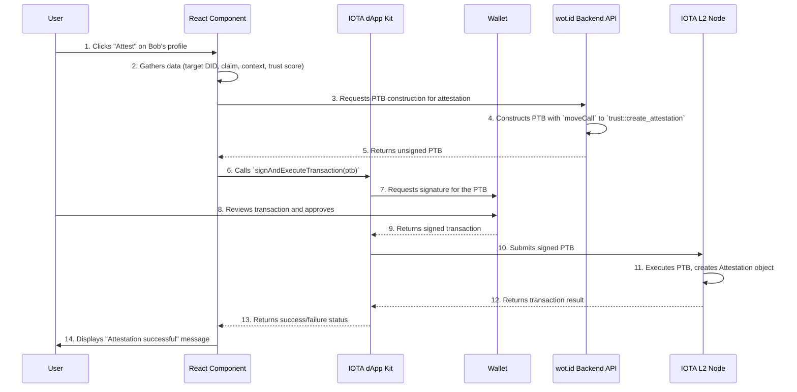

# 08: Frontend, UX, and Client Applications

## 1. UX Philosophy and Core Principles

The user experience of wot.id is shaped by its core commitments to user empowerment, security, and accessibility.

*   **Absolute User Control & SSI**: The UX is designed to give users uncompromising ownership over their digital identity.
*   **Guaranteed Human Identity**: The interface makes identity verification clear and trustworthy.
*   **Open and Accessible**: The UX strives for minimal friction and intuitive participation.
*   **Seamless, Zero-Fee Interactions**: Leveraging IOTA enables fluid, unencumbered engagement.
*   **Clarity & Simplicity**: Trust scores and their derivations are presented in an easily digestible format.
*   **Transparency & Optional Complexity**: While the default view is simple, users can always drill down into the details and evidence behind a trust assessment.
*   **Privacy by Design**: All interactions are handled with the utmost respect for privacy.

---

# 08: Frontend, UX, and Client Applications

## 1. UX Philosophy and Core Principles

The user experience of wot.id is shaped by its core commitments to user empowerment, security, and accessibility.

*   **Absolute User Control & SSI**: The UX is designed to give users uncompromising ownership over their digital identity.
*   **Guaranteed Human Identity**: The interface makes identity verification clear and trustworthy.
*   **Open and Accessible**: The UX strives for minimal friction and intuitive participation.
*   **Seamless, Zero-Fee Interactions**: Leveraging IOTA enables fluid, unencumbered engagement.
*   **Clarity & Simplicity**: Trust scores and their derivations are presented in an easily digestible format.
*   **Transparency & Optional Complexity**: While the default view is simple, users can always drill down into the details and evidence behind a trust assessment.
*   **Privacy by Design**: All interactions are handled with the utmost respect for privacy.

---

## 2. Key User Journeys & Core Interactions

This section outlines key user interactions within the wot.id ecosystem, detailing the steps from the user's perspective and the underlying technical processes.

### 2.1. Onboarding

#### 2.1.1. New User Onboarding & Initial Identity Creation

This journey describes how a new user creates their foundational wot.id Decentralized Identity (DID) on an IOTA L2 chain.

**Actors:**

*   **User:** The individual creating their identity.
*   **wot.id Frontend:** The Next.js web application.
*   **User's IOTA Wallet:** A non-custodial wallet (e.g., TanglePay) holding the user's private keys and IOTA tokens.
*   **wot.id Backend API:** Orchestrates operations and constructs Programmable Transaction Blocks.
*   **IOTA L2 Chain (with Move VM):** The smart contract platform where `wot.id` contracts are deployed.
*   **IOTA L1 (The Tangle):** The base layer providing security and settlement for the L2 chain.

**Steps:**

1.  **Initiation (User & Frontend):** The user selects "Create My Identity."
2.  **Wallet Connection (User, Frontend, Wallet):** The frontend uses `@iota/dapp-kit` to connect to the user's wallet.
3.  **Optional: Off-Chain Pre-Verification (User, Frontend, Backend):** The user can link existing accounts (email, social) via OAuth/OTP. This is off-chain.
4.  **Trigger DID Creation (User & Frontend):** The user confirms they want to create their on-chain identity.
5.  **Programmable Transaction Block (PTB) Construction (Backend API):** The backend constructs a PTB with a `moveCall` to `identity::create_identity`.
6.  **Transaction Signing & Submission (User, Frontend, Wallet, IOTA L2):** The frontend passes the PTB to the wallet. The user reviews and approves the transaction, including L2 gas fees.
7.  **Move VM Execution & Identity Allocation (IOTA L2 Chain):** The Move VM executes `identity::create_identity`, creating and sharing a new `Identity` object.
8.  **Confirmation (Frontend, User):** The frontend confirms the successful creation of the identity.
9.  **Optional: Issuing Initial Verifiable Credentials (Backend, IOTA L2):** The backend can now issue VCs to the new DID to attest to the pre-verified information.

#### 2.1.2. Onboarding via Familiar Logins (e.g., Email, Social Accounts)

This journey provides a near-instantaneous onboarding for users new to crypto.

1.  **Initiation via Familiar Method:** User selects "Sign up with Google/Email."
2.  **Standard Off-Chain Authentication:** User completes a standard OAuth or email verification flow.
3.  **Initial `wot.id` Profile Setup & Managed DID Creation:** The backend creates a profile and seamlessly provisions an IOTA L2 address and DID for the user, potentially using a managed key service. Gas fees are abstracted away.
4.  **Welcome to `wot.id`:** The user is logged in and can begin exploring.
5.  **Path to Full Self-Custody:** The user is guided on how to take full control of their keys and DID at their own pace.

#### 2.1.3. Onboarding with an Existing Non-IOTA Crypto Wallet (e.g., MetaMask)

This journey caters to crypto-savvy users from other ecosystems.

1.  **Initiation via "Connect Wallet":** User selects their non-IOTA wallet.
2.  **Connect and Verify External Wallet:** The user signs a message to prove ownership of the external address (off-chain).
3.  **Linking External Address & `wot.id` Profile Creation:** The backend links the verified address to a `wot.id` profile.
4.  **Provisioning an IOTA L2 Controller:** The user is guided to connect or create an IOTA wallet, which will control their new `wot.id` DID.
5.  **`wot.id` DID Creation:** The backend creates the DID, which can include a `VerificationMethod` linking to their verified non-IOTA wallet.

#### 2.1.4. Onboarding for IOTA-Native Users (with Existing IOTA Wallet)

This is the most direct path for users already in the IOTA ecosystem.

1.  **Initiation & Wallet Connection:** The user connects their existing IOTA wallet (e.g., TanglePay).
2.  **Trigger DID Creation:** The user confirms they want to create a DID linked to their wallet.
3.  **Programmable Transaction Block (PTB) Construction:** The backend constructs the PTB for `identity::create_identity`.
4.  **Transaction Signing & Submission:** The user signs and submits the transaction via their wallet.
5.  **Confirmation:** The DID is created, and the user is notified.

### 2.2. Core Interaction: Creating an Attestation

This flow illustrates how a user creates a trust attestation for another entity.

```mermaid
sequenceDiagram
    participant User
    participant ReactComponent as React Component
    participant DAppKit as IOTA dApp Kit
    participant Wallet
    participant BackendAPI as wot.id Backend API
    participant IOTANode as IOTA L2 Node

    User->>ReactComponent: 1. Clicks "Attest" on Bob's profile
    ReactComponent->>ReactComponent: 2. Gathers data (target DID, claim, context, trust score)
    ReactComponent->>BackendAPI: 3. Requests PTB construction for attestation
    BackendAPI->>BackendAPI: 4. Constructs PTB with `moveCall` to `trust::create_attestation`
    BackendAPI-->>ReactComponent: 5. Returns unsigned PTB
    ReactComponent->>DAppKit: 6. Calls `signAndExecuteTransaction(ptb)`
    DAppKit->>Wallet: 7. Requests signature for the PTB
    User->>Wallet: 8. Reviews transaction and approves
    Wallet-->>DAppKit: 9. Returns signed transaction
    DAppKit->>IOTANode: 10. Submits signed PTB
    IOTANode->>IOTANode: 11. Executes PTB, creates Attestation object
    IOTANode-->>DAppKit: 12. Returns transaction result
    DAppKit-->>ReactComponent: 13. Returns success/failure status
    ReactComponent->>User: 14. Displays "Attestation successful" message


## 2. Frontend Architecture and Technology Stack

### 2.1. High-Level Architecture

The `wot.id` frontend is a Next.js application that interacts with backend services, the IOTA L2 network, and the user's wallet extension to provide a seamless and secure experience.

```mermaid
graph TD
    subgraph "User's Browser"
        A[Next.js UI Components] --> B{IOTA dApp Kit};
        B --> C[Wallet Extension e.g., TanglePay];
        A --> D[wot.id Backend API];
    end

    subgraph "External Services"
        D --> E[IOTA L2 Node];
        C --> E;
    end

    subgraph "User"
        U(User) --> A;
    end

    style C fill:#f9f,stroke:#333,stroke-width:2px
    style E fill:#ccf,stroke:#333,stroke-width:2px
```

*   **Next.js Application**: Renders the UI and manages application state.
*   **IOTA dApp Kit**: A set of React hooks and components that simplify interaction with the IOTA network and wallets.
*   **Wallet Extension**: Securely stores the user's private keys and handles signing of transactions. The frontend **never** has access to private keys.
*   **wot.id Backend API**: Orchestrates complex operations, constructs PTBs, and interacts with the IOTA node.
*   **IOTA L2 Node**: The gateway to the IOTA network for submitting transactions and querying on-chain data.

### 2.2. Technology Stack

| Technology / Library | Role & Purpose |
| :--- | :--- |
| **Next.js** | Primary frontend framework for building the React application. |
| **React** | Core UI library for building components. |
| **TypeScript** | Provides static typing for improved code quality and maintainability. |
| **[`@iota/dapp-kit`](https://github.com/iotaledger/dapp-kit)** | **Primary SDK for UI Interaction**. Simplifies dApp development within React applications by providing hooks and components for wallet connection, transaction signing, and other common tasks. It is the preferred choice for most client-side interactions tied to the UI. |
| **[`@iota/iota-sdk`](https://github.com/iotaledger/iota-sdk)** | **Core SDK**. The foundational library for all IOTA interactions. It is used internally by the `@iota/dapp-kit` and is also essential for the `wot.id` Backend API. The frontend might use it directly for advanced operations not covered by the dApp kit or for client-side logic not directly tied to React components. |
| **Mermaid.js** | Used for rendering diagrams within the documentation. |
| **CSS Modules / Tailwind CSS** | For styling components and ensuring design consistency. |

### 2.3. Development Best Practices

*   **Framework Version Stability**: Utilize robust and proven versions of Next.js and dependencies to avoid instability.
*   **Clear Directory Structure**: Maintain a clean and logical project structure.
*   **Adherence to Canonical References**: Refer to authoritative versions of the codebase before major refactoring.
*   **Comprehensive Change Logging**: Document all substantial changes to avoid repeated errors.
*   **Robust Error Handling and User Feedback**: Implement comprehensive error handling for all external interactions (wallet connections, API calls, transaction submissions). Provide clear, concise, and user-friendly feedback for both successful operations and any errors encountered (e.g., wallet not connected, transaction rejected, insufficient funds, network issues).

---

## 3. Core Interaction: Creating an Attestation

This flow illustrates how a user creates a trust attestation for another entity, combining UI interaction, wallet signing, and on-chain execution via a PTB.



---

## 4. Client-Side IOTA Integration and Security

### 4.1. Client-Side Security & Wallet Management

**The most critical security principle is that the frontend application NEVER handles or stores the user's private keys or seed phrases.**

*   **Non-Custodial Wallets**: All signing operations are delegated to a non-custodial wallet extension (e.g., TanglePay, MetaMask Flask).
*   **dApp Kit as Intermediary**: The `@iota/dapp-kit` acts as a standardized and secure bridge between the application and the wallet. It requests actions (like signing), and the wallet prompts the user for confirmation. The application only receives the result (a signature or a rejection).
*   **User Confirmation**: Every sensitive action, especially transaction signing, requires explicit user approval via a prompt from the wallet extension.

### 4.2. Using the IOTA dApp Kit (`@iota/dapp-kit`)

The dApp Kit is the preferred method for building `wot.id` on React.

**1. Connecting a Wallet:**
The `ConnectButton` component provides a simple UI for users to connect their wallet.

```tsx
import { ConnectButton } from '@iota/dapp-kit';

function WalletConnector() {
  return <ConnectButton />;
}
```

**2. Signing and Executing a Transaction:**
The `useSignAndExecuteTransaction` hook simplifies the process of getting a user's signature and submitting a transaction.

```tsx
import { useSignAndExecuteTransaction, useCurrentAccount } from '@iota/dapp-kit';
import { Transaction } from '@iota/iota-sdk/transactions';

// Assume 'constructAttestationPtb' is a function that returns a built Transaction object
// from the Backend API or constructs it client-side.
async function constructAttestationPtb(userAddress: string): Promise<Transaction> {
    const tx = new Transaction();
    // Deployed wot.id package ID - must be obtained after deploying the wot.id Move contracts to the target network.
    const WOT_ID_PACKAGE_ID = '0x...'; 
    
    tx.moveCall({
        target: `${WOT_ID_PACKAGE_ID}::trust::create_attestation`,
        arguments: [ /* ... args for attestation ... */ ],
        typeArguments: []
    });
    // The SDK/Wallet will handle adding gas payment inputs.
    return tx;
}

function AttestationButton() {
  const { mutate, isPending } = useSignAndExecuteTransaction();
  const { account } = useCurrentAccount();

  const handleAttest = async () => {
    if (!account) {
      alert('Please connect your wallet first.');
      return;
    }
    const ptb = await constructAttestationPtb(account.address);
    mutate({ transaction: ptb });
  };

  return (
    <button onClick={handleAttest} disabled={isPending}>
      {isPending ? 'Submitting...' : 'Create Attestation'}
    </button>
  );
}
```

### 4.3. Handling `wot.id`-Specific Data (DIDs, VCs)

It is critical to understand that neither the IOTA SDK nor the dApp Kit has inherent knowledge of `wot.id`'s specific data structures (DIDs, Attestations, etc.). The client application is responsible for this domain-specific logic.

1.  **Constructing `wot.id` Data**: The client must create the JSON or other data formats for DIDs and attestations according to `wot.id` specifications.
2.  **Serializing Data for Move Calls**: The client must convert this data into the precise format expected by the `wot.id` Move contract functions. This often involves using a library like `bcs` to serialize the data into a `vector<u8>`.

This serialized data is then passed as a `tx.pure()` argument to the `moveCall` function. For guidance on BCS, refer to the [Move Language Book's section on BCS](https://move-language.github.io/move/modules-and-scripts.html#binary-canonical-serialization-bcs).

```typescript
// Example of client-side responsibility

// 1. Construct the wot.id-specific object
const attestationData = { 
  target: 'did:iota:0x123...', 
  claim: 'is_a_human',
  context: 'https://wot.id/contexts/v1/human_verification',
  score: 100000 // 100.000 * 1000
};

// 2. Serialize it using a wot.id-specific helper (application must implement this)
// const attestationBytes = MyWotIdBcsEncoder.serialize(attestationData); 

// 3. Pass the bytes to the PTB
// tx.moveCall({
//   target: 'wot_id_package::trust::create_attestation',
//   arguments: [tx.pure(attestationBytes)]
// });
```

This separation ensures the IOTA SDKs remain general-purpose, while the `wot.id` frontend handles its own application logic.

---

## 5. Key User Journeys & Features

This section outlines key user interactions within the wot.id ecosystem, detailing the steps from the user's perspective and the underlying technical processes.

### 5.1. New User Onboarding & Initial Identity Creation

This journey describes how a new user creates their foundational wot.id Decentralized Identity (DID) on an IOTA L2 chain.

**Actors:**

*   **User:** The individual creating their identity.
*   **wot.id Frontend:** The Next.js web application.
*   **User's IOTA Wallet:** A non-custodial wallet (e.g., TanglePay) holding the user's private keys and IOTA tokens.
*   **wot.id Backend API:** Orchestrates operations and constructs Programmable Transaction Blocks.
*   **IOTA L2 Chain (with Move VM):** The smart contract platform where `wot.id` contracts are deployed.
*   **IOTA L1 (The Tangle):** The base layer providing security and settlement for the L2 chain.

**Steps:**

1.  **Initiation (User & Frontend):**
    *   The user navigates to the wot.id application and selects an option like "Create My Identity" or "Sign Up."

2.  **Wallet Connection (User, Frontend, Wallet):**
    *   The frontend, utilizing the `@iota/dapp-kit`, prompts the user to connect their IOTA-compatible wallet.
    *   The user selects their wallet and approves the connection request.
    *   The frontend now has access to the user's public wallet address (which will become the initial controller of the DID) but **never** their private keys.

3.  **Optional: Off-Chain Pre-Verification (User, Frontend, Backend):**
    *   The user might be offered options to link existing accounts (e.g., email, social media profiles) via standard mechanisms like OAuth or OTP.
    *   The `wot.id` backend performs these verifications.
    *   **Crucially, this step is off-chain.** It serves to bootstrap the user's profile data and does not yet create the on-chain DID. This data can later be attested to with on-chain Verifiable Credentials once the DID exists.

4.  **Trigger DID Creation (User & Frontend):**
    *   After wallet connection (and any pre-verification), the user explicitly confirms they want to create their on-chain `wot.id` Identity by clicking a button like "Finalize Identity Creation."

5.  **Programmable Transaction Block (PTB) Construction (Backend API):**
    *   The frontend informs the `wot.id` Backend API of the user's intent, providing the connected wallet address.
    *   The Backend API constructs a **Programmable Transaction Block (PTB)**. This PTB will contain at least one `moveCall` instruction targeting the `identity::create_identity` function within the deployed `wot.id` Move contract package on the IOTA L2 chain.
    *   The `create_identity` function implicitly uses the transaction sender's address (the user's wallet address) as the initial controller.
    *   The backend API returns the unsigned PTB to the frontend.

6.  **Transaction Signing & Submission (User, Frontend, Wallet, IOTA L2):**
    *   The frontend, using the `@iota/dapp-kit`'s `useSignAndExecuteTransaction` hook, passes the PTB to the user's wallet.
    *   The wallet displays the transaction details, including the intended action (e.g., "Create wot.id Digital Identity") and an estimate of the **L2 gas fees** required for execution. These fees are payable in IOTA tokens (which might need to be bridged from L1 to the L2 if not already present).
    *   The user reviews and approves the transaction in their wallet.
    *   The wallet signs the PTB with the user's private key and submits it to the target IOTA L2 chain.

7.  **Move VM Execution & Identity Allocation (IOTA L2 Chain):**
    *   The IOTA L2 chain receives the signed PTB.
    *   The Move Virtual Machine executes the `identity::create_identity` function:
        *   The sender's address (from `tx_context::sender(ctx)`) is identified.
        *   A new, globally unique Object ID is generated via `object::new(ctx)`. This ID becomes the core of the DID.
        *   An `Identity` struct is instantiated with:
            *   `id`: The unique Object ID.
            *   `did`: A string representation derived from the Object ID (e.g., `did:iota:0x...`).
            *   `controller`: A vector initialized with the sender's address as the sole controller.
            *   `verification_method`: Initially empty or with a default.
            *   `privacy_settings`: Default values.
        *   The new `Identity` object is made a shared object on the L2 chain using `transfer::share_object`, making it publicly resolvable.
    *   **L2 Gas Fee Consumption:** The L2 chain deducts the actual gas consumed for these operations from the user's L2 account balance. These fees compensate L2 node operators for computation and storage, distinct from IOTA L1's feeless nature for basic data/value transfers.

8.  **Confirmation (Frontend, User):**
    *   The `@iota/dapp-kit` receives the transaction outcome (success or failure) from the L2 chain.
    *   The frontend updates the UI, confirming the successful creation of the user's `wot.id` Identity and may display their new DID.

9.  **Optional: Issuing Initial Verifiable Credentials (Backend, IOTA L2):**
    *   With the user's DID now on-chain, the `wot.id` backend (acting as an issuer with its own DID) can issue Verifiable Credentials (VCs) to the user's new DID.
    *   These VCs can formally attest to the information gathered during the off-chain pre-verification step (e.g., "Verified Email," "Linked X Account").
    *   This involves constructing and submitting further PTBs with `moveCall`s to `credentials::issue_credential`.

This journey ensures user control via their wallet, leverages the IOTA L2 for smart contract execution, and clearly distinguishes between off-chain data gathering and on-chain identity creation.

### 5.2. Onboarding via Familiar Logins (e.g., Email, Social Accounts)

This journey is for users new to `wot.id` and potentially new to blockchain/crypto, who prefer to start with familiar login methods. The aim is to provide a near-instantaneous onboarding experience, deferring crypto-specific complexities.

**Actors:** (Similar to 5.1, with emphasis on abstraction)

*   **User:** Individual seeking to use `wot.id`.
*   **wot.id Frontend:** Web application.
*   **wot.id Backend API & Identity Management Service:** Handles off-chain authentication, preliminary account setup, and potentially managed key services.
*   **(Behind the Scenes) IOTA L2 Chain & Move VM:** Where the `wot.id` DID is eventually anchored.

**Steps:**

1.  **Initiation via Familiar Method (User, Frontend):**
    *   User selects "Sign up with Google," "Sign up with Email," or a similar option.
    *   *User Experience Focus:* No immediate mention of wallets, private keys, or IOTA.

2.  **Standard Off-Chain Authentication (User, Frontend, Backend):**
    *   User completes a standard OAuth flow (for social logins) or an email verification (e.g., magic link, OTP).
    *   The `wot.id` Backend API verifies this authentication.

3.  **Initial `wot.id` Profile Setup & Managed DID Creation (Backend, IOTA L2):**
    *   Upon successful off-chain authentication, the `wot.id` Backend:
        *   Creates a preliminary user profile linked to their verified email/social ID.
        *   **Seamlessly provisions an IOTA L2 address for the user.** This could involve a managed key service where `wot.id` securely generates and stores an encrypted private key on behalf of the user (with clear terms regarding future exportability and user control).
        *   Constructs and processes a Programmable Transaction Block (PTB) to call `identity::create_identity` on the IOTA L2 chain, using the provisioned L2 address as the initial controller.
    *   *User Experience Focus:* The user sees their `wot.id` profile being created. The creation of an on-chain DID and the associated L2 address happens in the background. The concept of "gas fees" for this initial DID creation would ideally be subsidized or abstracted away by `wot.id` for this onboarding path to reduce friction.

4.  **Welcome to `wot.id` (Frontend, User):**
    *   The user is logged into their new `wot.id` account. They can start exploring features, building their profile, and understanding the value proposition.
    *   Information about their new digital identity (the DID) and the benefits of its self-sovereign nature can be introduced gradually.

5.  **Path to Full Self-Custody (Frontend, User, Wallet):**
    *   At any point, or when performing actions requiring more explicit on-chain interaction, the user is guided:
        *   To understand the concept of their `wot.id` DID being on a decentralized ledger.
        *   To set up their own self-custodial IOTA wallet (e.g., TanglePay or a simplified embedded wallet).
        *   To securely take control of the private key associated with their DID (e.g., by exporting it from the managed service and importing it into their own wallet, or by adding their self-custodial wallet as a controller and removing the managed key).
    *   *User Experience Focus:* Empowerment and education, allowing users to transition to full self-sovereignty at their own pace.

### 5.3. Onboarding with an Existing Non-IOTA Crypto Wallet (e.g., MetaMask)

This journey caters to users who are familiar with cryptocurrency wallets from other ecosystems (like Ethereum) but are new to IOTA and `wot.id`.

**Actors:**

*   **User:** Crypto-savvy individual.
*   **wot.id Frontend:** Web application.
*   **User's Non-IOTA Wallet (e.g., MetaMask):** For signing verification messages.
*   **wot.id Backend API:** Verifies external wallet ownership.
*   **(Optional) User's IOTA Wallet:** To be created or connected for full `wot.id` DID control.
*   **IOTA L2 Chain & Move VM:** Where the `wot.id` DID is created.

**Steps:**

1.  **Initiation via "Connect Wallet" (User, Frontend):**
    *   User clicks "Connect Wallet" and might see options including "MetaMask" or other popular non-IOTA wallets alongside IOTA-native options.

2.  **Connect and Verify External Wallet (User, Frontend, Non-IOTA Wallet, Backend):**
    *   User connects their chosen non-IOTA wallet (e.g., MetaMask).
    *   The `wot.id` frontend prompts the user to sign a message with this wallet to prove ownership of the external address. This is an off-chain verification.
    *   The signed message is sent to the `wot.id` Backend API for verification.

3.  **Linking External Address & `wot.id` Profile Creation (Backend):**
    *   Upon successful verification, the backend links the verified external address to a new or existing preliminary `wot.id` user profile.

4.  **Provisioning an IOTA L2 Controller for `wot.id` DID (User, Frontend, Wallet/Backend):**
    *   To create and control a `wot.id` DID on the IOTA L2, an IOTA L2 address is required. The user is guided through:
        *   **Option A (Connect/Create IOTA Wallet):** Connecting an existing IOTA wallet (e.g., TanglePay) or creating a new one. This IOTA wallet address will become a controller of their `wot.id` DID.
        *   **Option B (Managed IOTA L2 Key - less ideal for this audience but possible):** Similar to 5.2, `wot.id` could offer to manage an IOTA L2 key pair for them, though crypto-savvy users typically prefer self-custody.
    *   *User Experience Focus:* Clear explanation of why an IOTA L2-compatible address/wallet is needed for `wot.id` specific functions, while acknowledging their existing crypto presence.

5.  **`wot.id` DID Creation (Backend, IOTA L2):**
    *   Once an IOTA L2 controller address is established, the `wot.id` Backend API constructs a PTB for `identity::create_identity`.
    *   The transaction is signed (either by the user's new IOTA wallet or implicitly if a managed key is used for this step) and submitted.
    *   The new `wot.id` `Identity` object can include a `VerificationMethod` linking back to their verified non-IOTA wallet address, formally associating the two.

6.  **Integrated `wot.id` Experience (Frontend, User):**
    *   The user sees their `wot.id` profile, now associated with both their external crypto address (e.g., for display or cross-chain attestations) and their new `wot.id` DID for core identity functions.
    *   The platform can now potentially display balances or NFTs from their linked external wallet (by querying the respective chain), offering a more holistic view of their digital assets and identity, all anchored by `wot.id`.

These journeys prioritize abstracting unnecessary technical details while providing clear paths to user empowerment and self-sovereignty. The emphasis is on "show, don't just tell" by enabling users to quickly engage with `wot.id`'s benefits.

### 5.4. Onboarding for IOTA-Native Users (with Existing IOTA Wallet)

This journey is for users already familiar with the IOTA ecosystem and who possess an IOTA-compatible self-custodial wallet (e.g., TanglePay). This is the most direct path to creating a self-sovereign `wot.id` DID.

**Actors:**

*   **User:** IOTA-savvy individual with an existing IOTA wallet.
*   **wot.id Frontend:** The Next.js web application.
*   **User's IOTA Wallet:** (e.g., TanglePay) holding private keys and IOTA tokens.
*   **wot.id Backend API:** Constructs Programmable Transaction Blocks.
*   **IOTA L2 Chain (with Move VM):** Where `wot.id` contracts are deployed.
*   **IOTA L1 (The Tangle):** Base layer.

**Steps:**

1.  **Initiation & Wallet Connection (User, Frontend, Wallet):**
    *   User navigates to `wot.id` and selects "Connect Wallet" or "Create Identity."
    *   The frontend, via `@iota/dapp-kit`, prompts for wallet connection.
    *   User connects their existing IOTA wallet, approving the connection. The frontend gains access to their public wallet address.

2.  **Trigger DID Creation (User & Frontend):**
    *   The user confirms their intent to create a new `wot.id` Identity linked to their connected IOTA wallet address.

3.  **Programmable Transaction Block (PTB) Construction (Backend API):**
    *   The `wot.id` Backend API is notified.
    *   It constructs a PTB with a `moveCall` to `identity::create_identity`. The connected wallet address will be the transaction sender and thus the initial controller.
    *   The unsigned PTB is returned to the frontend.

4.  **Transaction Signing & Submission (User, Frontend, Wallet, IOTA L2):**
    *   The frontend passes the PTB to the user's IOTA wallet.
    *   The wallet displays transaction details, including the action (DID creation) and estimated L2 gas fees (payable in IOTA tokens from their wallet).
    *   User reviews and approves the transaction in their wallet.
    *   The wallet signs and submits the PTB to the IOTA L2 chain.

5.  **Move VM Execution & Identity Allocation (IOTA L2 Chain):**
    *   The IOTA L2 executes `identity::create_identity`.
    *   A new `Identity` object is created, with the user's connected IOTA wallet address as the sole controller.
    *   L2 gas fees are deducted.

6.  **Confirmation & `wot.id` Profile Access (Frontend, User):**
    *   The frontend receives confirmation of successful DID creation.
    *   The user can now access their `wot.id` profile, with their new DID directly controlled by their existing IOTA wallet. They can immediately start using `wot.id` features, manage their DID (add more controllers/verification methods), issue credentials, and build their trust network.

This journey is streamlined for users already comfortable with IOTA wallet operations, offering them the quickest route to a self-managed `wot.id` identity.

---

## 6. Future Directions

*   **Advanced Personalization**: Learning user preferences (with explicit consent) to tailor trust insights.
*   **Gamification and Incentives**: Encouraging participation in building the web of trust.
*   **Interactive Educational Modules**: Helping users master the nuances of decentralized trust.
